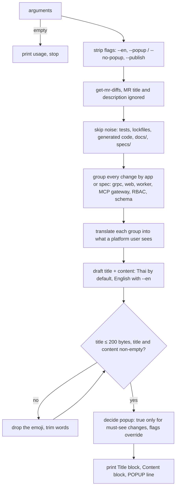
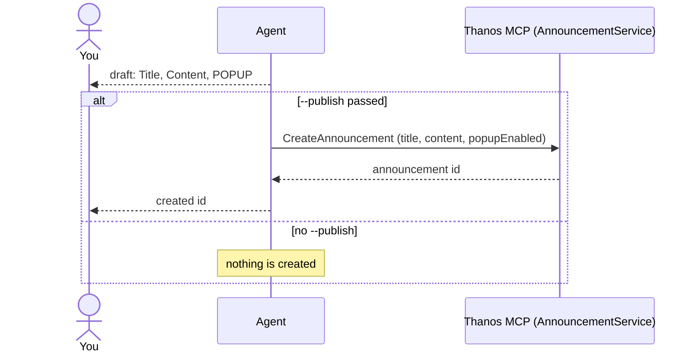

# announce

Drafts a Thanos markdown announcement from a GitLab MR diff, with a popup recommendation. Publishes only when asked.

## When to use it

- An MR shipped (or is about to) and platform users should hear about it.
- You want one release roundup that covers every app in the MR, not only the web UI.
- Say: "announce this MR", "write an announcement", `/announce 123 --en`.

| You want | Use instead |
|----------|-------------|
| A short changelog for developers | `generate-changelog` |
| The MR's own title and description rewritten | `update-merge-request` |
| An end-user guide for a feature | `user-guide` |
| A code review of the MR | `review-code` |

## How it works

From MR to draft:



Publishing, only with `--publish`:



Rules the diagrams don't show:

- The title limit is 200 bytes, checked with `printf '%s' "<title>" | wc -c`. A Thai character is 3 bytes, an emoji 4.
- Content is GitHub-flavored markdown, no raw HTML. One emoji in the title and one per section header.
- A not-yet-merged MR is fine; its state is flagged in chat.
- No local paths, sandbox names or internal branch names in the content.

## Input → output

Input: `<mr-url | project!iid | iid> [--en] [--popup|--no-popup] [--publish]`

Output: a chat reply, in this order:

```
<one line: what the MR does, user-facing or not>
**Title**    code block: plain title, ≤ 200 bytes
**Content**  code block: greeting, intro, ✨ what's new, 👉 what you need to do (if any)
POPUP: <true|false> — <reason>
```

With `--publish`, also one announcement created in Thanos and its id.

## Files in the skill folder

| Path | What |
|------|------|
| [SKILL.md](SKILL.md) | The agent's instructions, the announcement schema and validation rules |

## Related skills

- `get-mr-diffs`: fetches the MR diff.
- `generate-changelog`: the same MR as a developer changelog.
- `update-merge-request`: the same MR as its own title and description.
