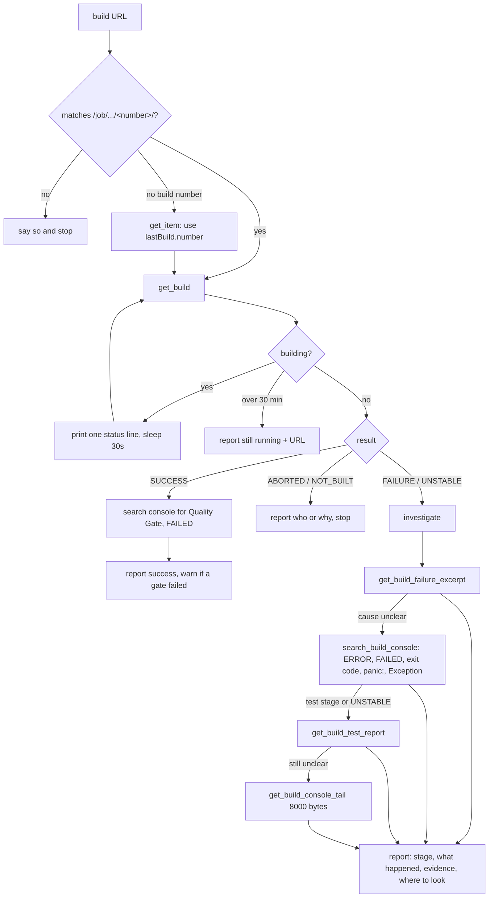

# check-job

Watches one Jenkins build from its URL until it ends, then explains any failure in plain words. Read-only.

## When to use it

- A Jenkins build is running and you want to know when it ends and how.
- A build failed and you want the cause, with the log lines that prove it.
- Say: "why did the build fail", or paste a build link.

| You want | Use instead |
|----------|-------------|
| A review of the code before it builds | `review-code` |
| Checks that services reach each other after a deploy | `smoke-test` |
| Steps to do before and after a deploy | `deploy-plan` |
| A record of the problem and its fix | `issue-log` |

## How it works

Poll, check the result, then dig into the log only when needed.



Rules the diagram doesn't show:

- Never starts, stops or reconfigures a build. Never edits files or runs git.
- Quotes only the log lines that prove the cause. No log, no guess: "not enough log evidence".
- No patch in the report. It ends with "Review the evidence above before any fix is made."
- On an auth error from the Jenkins MCP, it says which credentials are missing and stops.

## Input → output

Input: `<jenkins-build-url>`, shaped `http(s)://<host>/job/<name>[/job/<sub>...]/<number>/`. Job names and MR refs are refused.

Output: a chat reply.

```
Build: <fullname> #<number> - <result> - <duration>
Trigger / Link / Failed stage
What happened     1-3 bullets
Evidence          the exact log lines, trimmed
Where to look     each item marked "confirmed by log" or "likely"
Next step
```

## Files in the skill folder

| Path | What |
|------|------|
| [SKILL.md](SKILL.md) | The agent's instructions |

## Related skills

- `review-code`: catches problems before the build runs.
- `smoke-test`: checks the services after the build deploys.
- `issue-log`: saves the cause and fix once you know them.
