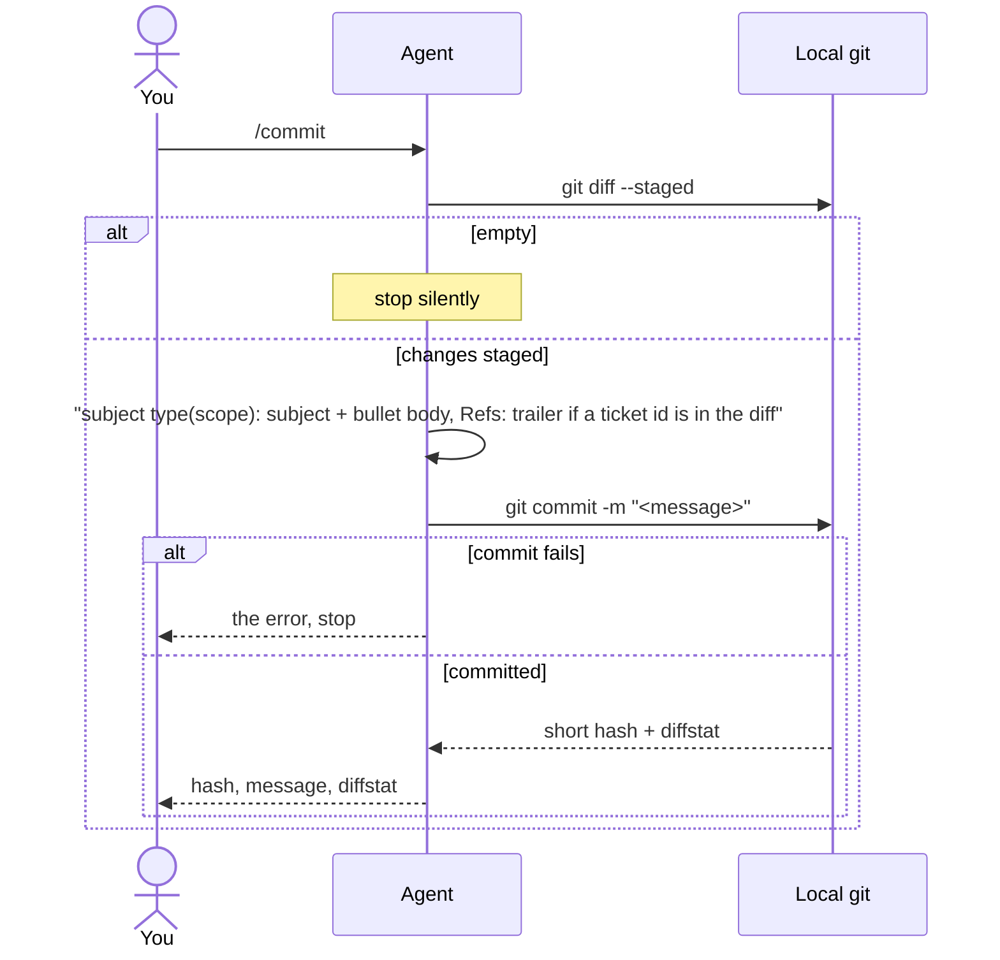

# commit

Commits your staged changes with a conventional commit message written from the diff. Never pushes.

## When to use it

- You ran `git add` and want a clean commit message without writing it.
- Run it by name only: `/commit`. The agent never starts it on its own.

| You want | Use instead |
|----------|-------------|
| A review of the staged changes first | `review-code` |
| A new title and description for an MR | `update-merge-request` |
| Your commits summed up as weekly achievements | `weekly-work-log` |

## How it works

Two git calls, nothing else.



Message rules:

| Part | Rule |
|------|------|
| Type | `feat` `fix` `refactor` `chore` `docs` `test` `style` `perf` `ci` |
| Scope | From the changed paths; left out when changes span many areas |
| Subject | Imperative, lowercase after the colon, no period, max 72 chars |
| Body | Always; `- ` bullets, imperative, wrapped at about 72 chars |
| Trailer | `Refs: TICKET-123` only when a ticket id is in the diff |

- Never runs `git log`, `git status`, `git show` or any other history command.

## Input → output

Input: none. It reads what is staged.

Output: one commit in the local repo, and a chat reply:

```
**Committed `<short-hash>`:**
<message in a fenced block>
- <X> files changed, <Y> insertions(+), <Z> deletions(-)
```

## Files in the skill folder

| Path | What |
|------|------|
| [SKILL.md](SKILL.md) | The agent's instructions |

## Related skills

- `review-code`: review the staged changes before you commit.
- `update-merge-request`: write the MR text once the commits are pushed.
