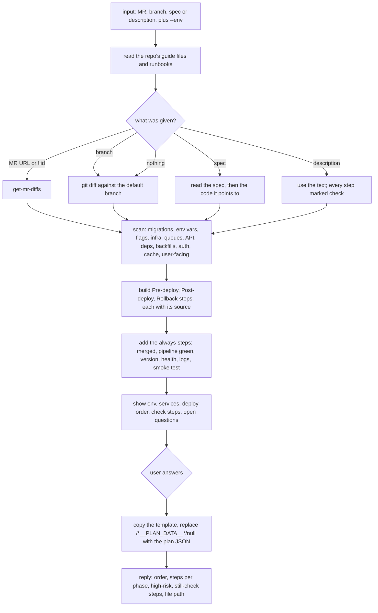
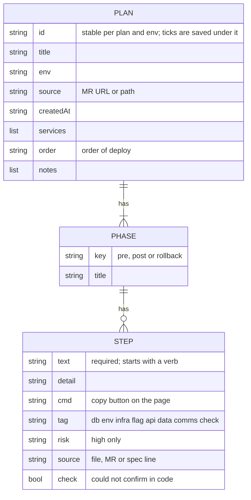

# deploy-plan

Builds a deployment plan as one clickable HTML checklist, split into Pre-deploy, Post-deploy and Rollback steps, from an MR, a branch, a spec or a described release.

## When to use it

- You are about to release a change and want every step around the deploy, taken from the change itself.
- You want migrations, new env vars, flags, queues, API order and rollback spelled out before you start.
- You want a checklist you tick while you deploy, then copy as Markdown or save as PDF.
- Say: "deployment plan for this MR", "what do I need to do before and after deploy", "deploy plan for !123 --env staging".

| You want | Use instead |
|----------|-------------|
| Check after the deploy that services still reach each other | `smoke-test` |
| A short changelog of the MR | `generate-changelog` |
| An announcement of the change for users | `announce` |
| A review of the diff itself | `review-code` |
| Why a Jenkins build failed | `check-job` |

## How it works

Plan only. It never runs a migration, sets an env var, deploys, or calls a write tool.



The plan JSON the page reads:



Rules the diagrams don't show:

- `pre` and `post` phases are required. `rollback` is added when there is a way back; a step that cannot be undone is said plainly.
- Secrets never appear. A step names the env var, never its value.
- One action per step. No generic "check everything" filler.
- The repo's guide files win on deploy steps, tools and names.

## Input → output

Input: `<MR url | !iid | branch | spec path | description> [--env <env>]`

- No input: the current branch against the default branch.
- No `--env`: the agent asks.

Output: one HTML file, at the repo root unless the repo already has a place for deploy docs.

```
<repo>/
└── deploy-plans/
    └── <YYYY-MM-DD>-<slug>.html   the checklist: tick steps, Hide done, Copy as Markdown, Export PDF, Reset
```

- Ticks are saved in the browser under the plan's `id`, so a reopened page keeps them.
- Plus a chat reply: env, deploy order, steps per phase, high-risk steps, steps still marked check, the file path.

## Files in the skill folder

| Path | What |
|------|------|
| [SKILL.md](SKILL.md) | The agent's instructions |
| [template/deploy-plan-template.html](template/deploy-plan-template.html) | The checklist page; the agent fills in the plan JSON and changes nothing else |

## Related skills

- `get-mr-diffs`: fetches the MR diff this skill reads.
- `smoke-test`: the post-deploy service check; the plan gives its run command when the repo has `scripts/smoke/`.
- `generate-changelog`: the changelog a user-facing step can link.
- `announce`: the announcement a user-facing step can link.
