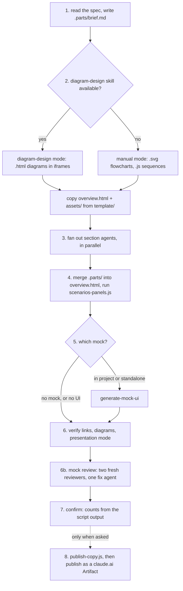
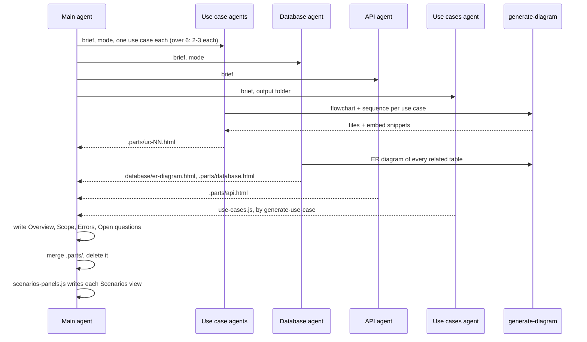
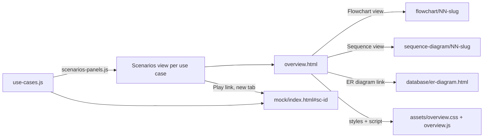

# design-feature

Plans a feature as a browsable HTML folder: use cases with their flowcharts, sequence diagrams and scenarios, database and API changes, errors and open questions.

## When to use it

- You have a spec, ticket or idea, and you want the whole plan in one page people open in a browser.
- You want each use case drawn twice: its logic (flowchart) and how its services talk (sequence).
- You want an optional clickable mock linked from each scenario.
- Say: "design this feature", "plan spec 127".

| You want | Use instead |
|----------|-------------|
| One flowchart, sequence or ER diagram | `generate-diagram` |
| A mock alone, for a plan that already exists | `generate-mock-ui` |
| Only the use cases and scenarios | `generate-use-case` |
| Play the scenarios on the real running app | `play-scenarios` |
| A test case file an AI runs later | `generate-test-cases` |
| A styled docs page from files or a topic | `html-document` |

## How it works

Eight steps. The main agent reads the source once, sub-agents build the sections in parallel, and the main agent merges them.



Who writes what in step 3. Only the main agent edits `overview.html`:



How the plan folder links together:



Rules the diagrams don't show:

- Every name (RPC, endpoint, table, field, job) comes from the source. Unknown → `TBD`.
- Use cases and scenarios are written only by `generate-use-case`. Scenarios views are generated, never typed by hand.
- Pages are dark only, Quiet Sheet theme. `overview.css` is a template copy; no new classes, no inline styles.
- No external scripts, styles or fonts in `overview.html` or the diagram files.
- Every count reported (scenarios per use case, total) comes from a script's output.

## Input → output

Input: `<spec-folder | feature description> [output-path]`

- A spec folder or file is the source of truth. A plain description works too; every unknown becomes `TBD`.
- No output path: `<spec-folder>/plan/` for a spec folder, else `plans/<feature-slug>/` at the project root.

Output:

```
<output>/
├── overview.html              entry page: rail, every section, every diagram, Present and Export PDF
├── assets/
│   ├── overview.css           copied from the template unchanged
│   └── overview.js
├── flowchart/
│   └── NN-<uc-slug>.svg       one per use case (.html in diagram-design mode)
├── sequence-diagram/
│   ├── render.js              manual mode only
│   └── NN-<uc-slug>.js        one per use case (.html in diagram-design mode)
├── database/
│   └── er-diagram.html        every related table and FK
├── use-cases.js               use cases + scenarios, by generate-use-case
└── mock/                      optional standalone mock, by generate-mock-ui
```

An in-project mock lives in the app instead, at `<routes-root>/mock/spec<NNN>/`.

Step 8 (only when asked) writes a publish copy outside the plan folder: `overview.html` becomes `index.html`, and links lose `target="_blank"`.

## Files in the skill folder

| Path | What |
|------|------|
| [SKILL.md](SKILL.md) | The agent's instructions |
| [scripts/scenarios-panels.js](scripts/scenarios-panels.js) | Writes each use case's Scenarios view from `use-cases.js`, with Play links when a mock exists; prints the counts |
| [scripts/publish-copy.js](scripts/publish-copy.js) | Builds a copy that works as a claude.ai Artifact and prints the publish arguments |
| [template/overview.html](template/overview.html) | The entry page; copied, then filled in |
| [template/assets/](template/assets/) | `overview.css` + `overview.js`; copied unchanged |
| [template/flowchart/](template/flowchart/) | Preview diagrams; not copied. Synced from `generate-diagram` |
| [template/sequence-diagram/](template/sequence-diagram/) | Preview diagrams + `render.js`; not copied. Synced from `generate-diagram` |
| [template/database/](template/database/) | Preview ER diagram; not copied. Synced from `generate-diagram` |
| [template/mock/](template/mock/) | Preview mock; not copied. Synced from `generate-mock-ui` |
| [template/use-cases.js](template/use-cases.js) | Example use cases for the preview; not copied |

## Related skills

- `generate-use-case`: writes `use-cases.js`.
- `generate-diagram`: draws every flowchart, sequence and ER diagram.
- `generate-mock-ui`: builds the optional mock and its Play links.
- `play-scenarios`: plays the plan's scenarios on the running app, in `<plan>/live/`.
- `generate-test-cases`: reads the same `use-cases.js`.
