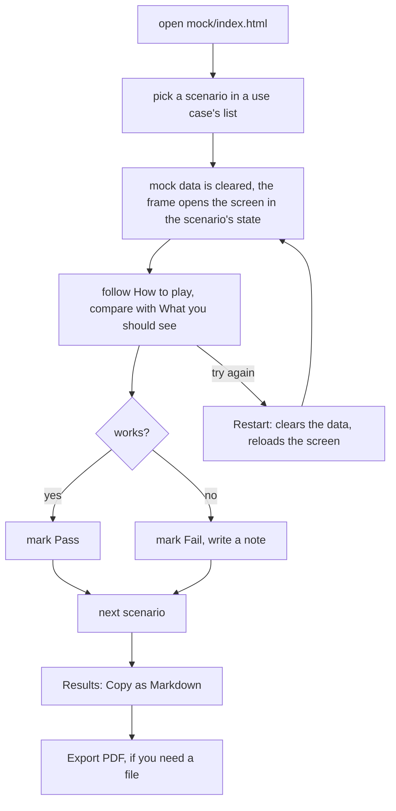

# Mock UI

A clickable mock of this feature's screens, with fake data and every edge state, to play each scenario and mark it Pass or Fail.

## How to open it

1. Open `mock/index.html` in a browser, straight from disk. No server, no build.

    ```bash
    open mock/index.html        # macOS
    xdg-open mock/index.html    # Linux
    ```

2. Keep `mock/` inside the plan folder: its pages read `../use-cases.js`.
3. Be online: the screens load the app's CSS framework from a CDN.

To open one screen in one state, without the index:

```
mock/page/<screen>.html?state=<state id>
```

The pink, dashed **Mock state** panel on that screen switches states. It is mock-only, not part of the product.

## Using it



- Each pick and each Restart starts clean. The audit log shows what the real service would write.
- Pass / Fail marks and notes stay in this browser only. Copy them before you switch browsers.
- `#sc-<id>` at the end of the URL opens that scenario. The plan's Play links use it.

## Files

| File | What |
|------|------|
| `index.html` | The play page: one block per use case, framed screen, guide, Results, audit log, contract links |
| `page/<screen>.html` | One screen; its state comes from `?state=` and the params a scenario needs |
| `page/console.html` | MCP / API client for API scenarios; only when the feature has one |
| `contract/types.ts` | The real request, response and error shapes to implement |
| `contract/rules.js` | The spec's rules as pure functions; the fake API runs them |
| `contract/data.js` | Mock data in the real upstream shapes |
| `shared/scenario-play.js` | How to play each scenario: state, page, steps |
| `shared/states.js` | The screens, and each mock state's data, permissions and faults |
| `shared/fake-api.js` | Stand-in for the real operations, same names and request shapes |
| `shared/components.js` | The app's component class strings |
| `shared/shell.js` | The app's chrome, plus the mock-only state / scenario panel |
| `../use-cases.js` | The use cases and scenarios this mock plays |

## When it fails

| You see | Do this |
|---------|---------|
| Blank index; the browser console says `USE_CASES is not defined` or `SCENARIOS is not defined` | `../use-cases.js` is missing. Open the mock from inside its plan folder. |
| Screens have no styling | The CSS framework loads from a CDN. Go online and reload. |
| A screen opened on its own shows rows from an earlier try | Press `Reset mock data` (or `Start over`) in the pink panel. |
| Pass / Fail marks are gone | They live in this browser's storage. A private window or cleared site data loses them; copy the Results table first. |
| An error or empty state in a screen | Check the state label above the frame. Many scenarios show an error on purpose. |
