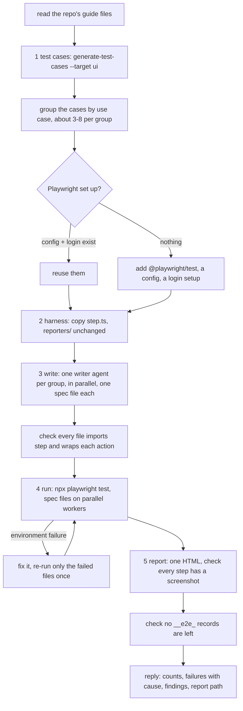
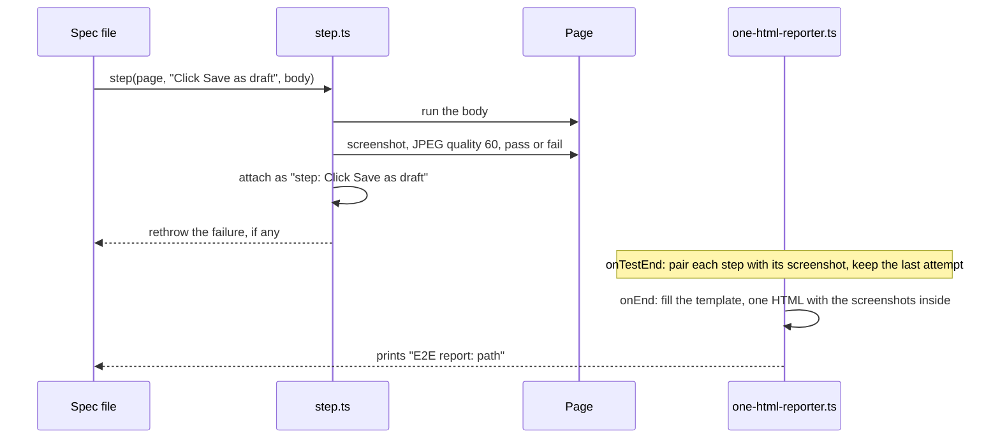
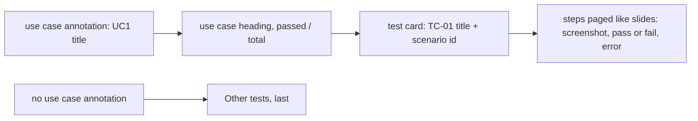

# e2e-test

Writes and runs Playwright browser tests for a feature, with a screenshot at every step and one self-contained HTML report.

## When to use it

- You want a feature tested in a real browser, with proof of every step.
- You want the results grouped by use case and scenario, in one file you can share.
- Say: "e2e test spec 127", "test this in the browser".

| You want | Use instead |
|----------|-------------|
| A test case file only, run later | `generate-test-cases` |
| Play the scenarios by hand on the running app | `play-scenarios` |
| Check after a deploy that services reach each other | `smoke-test` |
| A clickable mock with fake data | `generate-mock-ui` |

## How it works

Five phases. The harness is added once per repo; the rest runs per feature.



One test, step by step:



How the report groups tests:



Rules the diagrams don't show:

- Tests only. It never changes app code to make a test pass; a missing selector or a bug is a finding.
- It owns its data: records prefixed `__e2e_`, deleted after, checked gone.
- Never against production unless named for this run.
- The repo's own guide (where tests live, how to run tools) wins over the skill.
- Report: failed tests first, every test starts closed, filters use Playwright's own outcome; retries show under "Earlier attempts" and flaky tests are marked.

## Input → output

Input: `<spec folder | spec number | feature description> [--env <name>] [--base-url <url>]`

- No `--env` or `--base-url` → the repo's local dev URL.

Output, in the target repo:

```
<spec-path>/PRIVATE/test/
└── test-cases-ui-<n>.md               from generate-test-cases
<e2e-dir>/
├── README.md                           how to run the tests, for teammates
├── step.ts                             step() helper: one screenshot per step
├── reporters/
│   ├── one-html-reporter.ts            writes one HTML per run
│   └── e2e-report-template.html        the report page, dark theme, Export PDF
├── <group>.e2e.spec.ts                 one per use case group
└── e2e-results/                        gitignored
    └── e2e-report-<feature>-<stamp>.html
```

Plus a `playwright.config.*` and login setup when the repo had none.

## Files in the skill folder

| Path | What |
|------|------|
| [SKILL.md](SKILL.md) | The agent's instructions |
| [references/writer-agent.md](references/writer-agent.md) | The prompt for each writer agent: selectors, annotations, `step()`, data, waits |
| [template/step.ts](template/step.ts) | `step()`: wraps `test.step` and attaches a screenshot of how it ended |
| [template/one-html-reporter.ts](template/one-html-reporter.ts) | Playwright reporter: one self-contained HTML per run |
| [template/e2e-report-template.html](template/e2e-report-template.html) | The report page the reporter fills in |
| [template/README.md](template/README.md) | Ships as the e2e folder's `README.md` |

## Related skills

- `generate-test-cases`: writes the `--target ui` test case file this skill turns into tests.
- `generate-use-case`: its use case and scenario ids group the report.
- `play-scenarios`: the same flows, played by hand.
- `smoke-test`: service checks after a deploy, not the UI.
