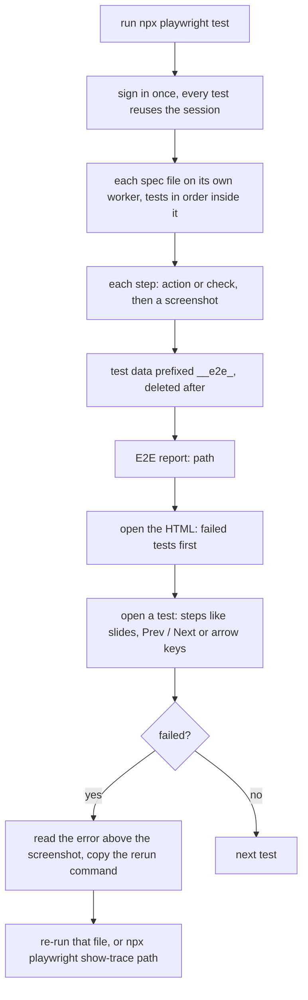

# E2E tests

Playwright browser tests for this feature. Every step takes a screenshot, and every run writes one HTML report.

## How to run it

1. Start the app, or pick the environment to test. Never production unless that is the plan for this run.

2. Run the tests, from the folder that holds the Playwright config:

    ```bash
    PW_BASE_URL=http://localhost:3000 E2E_REPORT_NAME=<feature> npx playwright test <e2e-dir>
    ```

    - `PW_BASE_URL` is the app to test. Left out → the config's local URL.
    - `E2E_REPORT_NAME` names the report file. Left out → the config's `name`.
    - Add a spec file path to run one group only.
    - The repo's guide may say to run tools another way (for example inside Docker). Follow it.

3. Open the path it prints at the end: `E2E report: <path>`.

## Using it



- The report is one file with the screenshots inside. Share it as-is, or use Export PDF.
- Tests are grouped by use case; each shows its scenario id.

## Files

| File | What |
|------|------|
| `<group>.e2e.spec.ts` | One spec file per use case group; one `test()` per test case |
| `step.ts` | `step()` helper: runs one step and attaches its screenshot, pass or fail |
| `reporters/one-html-reporter.ts` | Writes the whole run as one HTML file |
| `reporters/e2e-report-template.html` | The report page; dark theme, Export PDF |
| `e2e-results/` | Reports, one per run, named `e2e-report-<name>-<stamp>.html`; gitignored |
| `playwright.config.*` | Base URL, viewport, workers, reporters, login state |

## When it fails

| You see | Do this |
|---------|---------|
| `net::ERR_CONNECTION_REFUSED` on every test | The app is not running at `PW_BASE_URL`. Start it, then re-run only the failed files. |
| Tests land on the sign-in page | The saved login state expired. Re-run so the global setup signs in again; check the login env vars. |
| `ENOENT` … `e2e-report-template.html` | The reporter's `template` path is wrong. It is relative to the folder that holds the Playwright config. |
| `No data in this report.` | You opened `reporters/e2e-report-template.html` itself. Open the file in `e2e-results/` instead. |
| `No screenshot for this step` | That step's screenshot failed (the page was closed or crashed). Read the step's error. |
| A test marked flaky | It passed on a retry. Open "Earlier attempts" to see the failed try. |
| A failed step with a real error | Keep it: it is a product bug or a wrong selector. Use the copied rerun command after a fix. |
