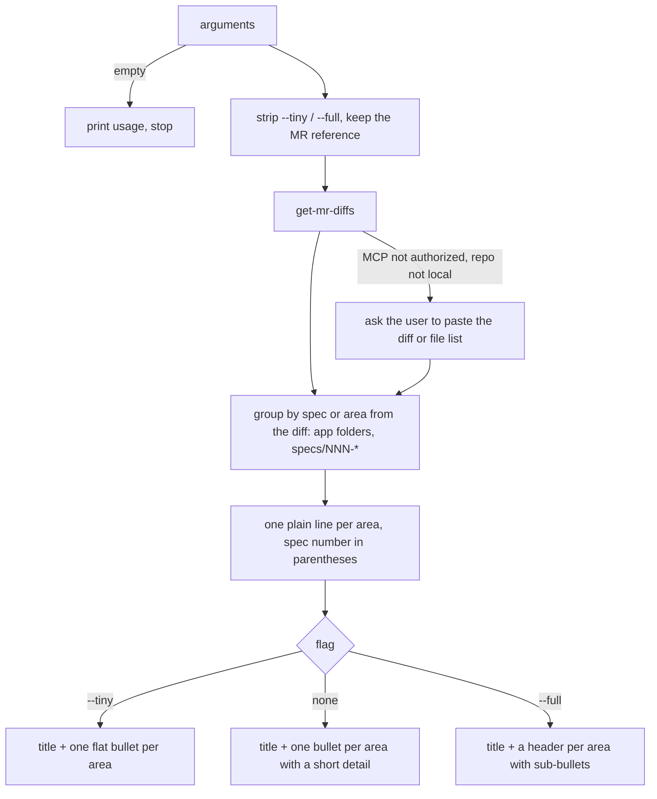

# generate-changelog

Turns a GitLab merge request diff into a short changelog, grouped by spec or area, in one copy-paste code block.

## When to use it

- You need a changelog for an MR to paste into a release note or chat.
- The MR description is stale and you want what the diff really changed.
- Say: "changelog for this MR", "what changed in !123".

| You want | Use instead |
|----------|-------------|
| The MR's title and description rewritten and saved | `update-merge-request` |
| A Thanos announcement for platform users | `announce` |
| A code review of the MR | `review-code` |
| Your own commits as weekly achievements | `weekly-work-log` |

## How it works



Rules the diagram doesn't show:

- The diff is the only source. The MR title and description are never used.
- No local paths, sandbox names or internal branch names in the output.
- One MR, one changelog. It never edits the MR.

## Input → output

Input: `<mr-url | project!iid | iid> [--tiny|--full]`

Output: one short chat note (which MR, its state), then one code block in chat, tagged `text`:

```
<short summary of the changes> (MR !<iid>)
- <area> (spec 101): <what changed>
- <area>: <what changed>
```

## Files in the skill folder

| Path | What |
|------|------|
| [SKILL.md](SKILL.md) | The agent's instructions |

## Related skills

- `get-mr-diffs`: fetches the MR diff.
- `update-merge-request`: writes the same facts into the MR itself.
- `announce`: turns the same diff into a user-facing announcement.
