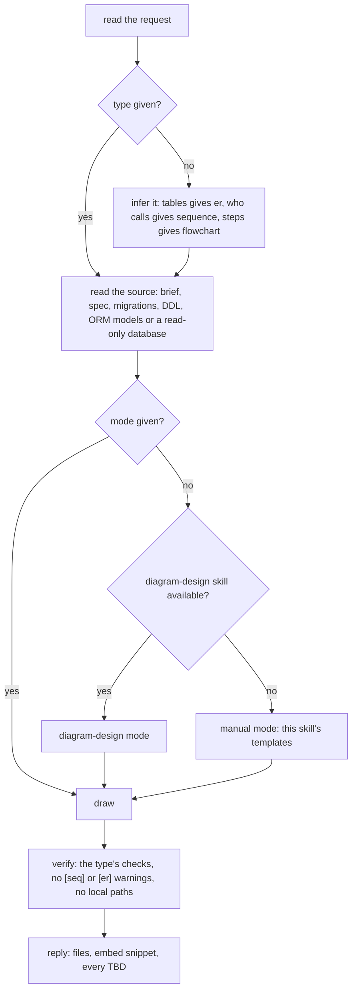
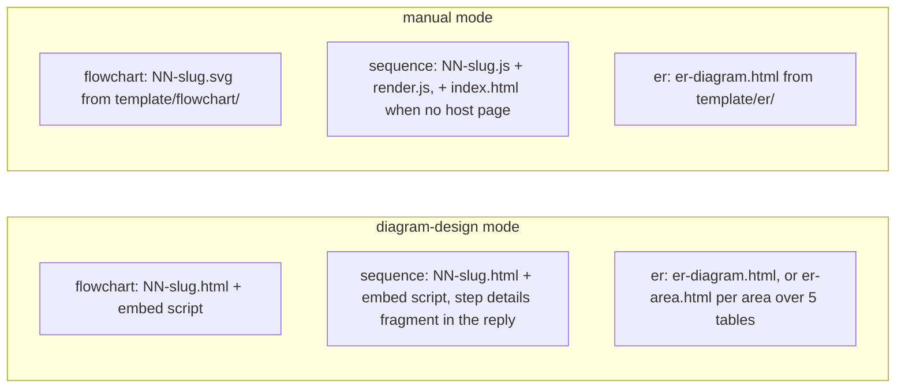
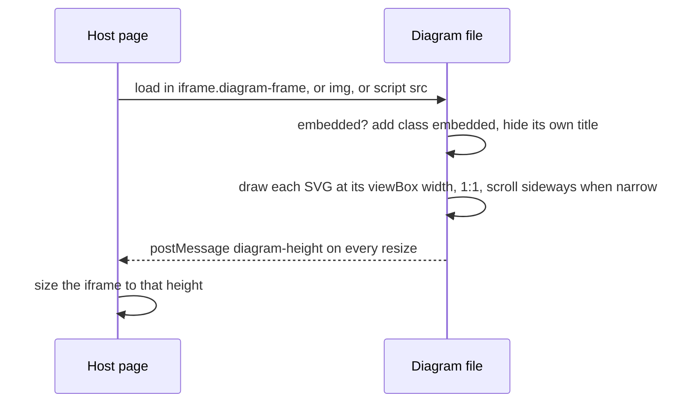

# generate-diagram

Draws one flowchart, sequence diagram or ER diagram as a local file that a browser opens or another page embeds.

## When to use it

- You want one diagram of one flow, or one schema, from a spec, a brief, migrations or a database.
- Another skill draws several diagrams and wants them all in one style (design-feature calls it).
- Say: "flowchart of the login flow", "sequence diagram of the redeploy flow", "ER diagram of these tables".

| You want | Use instead |
|----------|-------------|
| A full feature plan: use cases, flows, database, API, open questions | `design-feature` |
| A clickable mock of the screens | `generate-mock-ui` |
| A slide deck or docs page | `html-presentation` / `html-document` |

| Type | Shows |
|------|-------|
| `flowchart` | One flow's logic: steps, yes / no decisions, loops, end states |
| `sequence` | Who calls whom, in what order, what comes back, which writes leave the service |
| `er` | Tables, columns, types, keys and foreign keys, with what changes |

## How it works

Five steps. The mode decides which drawing engine makes the file.



What each type and mode writes:



How a host page shows a diagram (design-feature's `overview.html`):



Rules the diagrams don't show:

- Every name (RPC, endpoint, table, column, job, screen) comes from the source. Unknown → `TBD`.
- Budgets: at most 12 nodes per flowchart and 7 participants per sequence diagram; more → split and say so.
- Dark only, in the shared theme. Every label is 14px. Manual-mode files load nothing from the network.
- It writes only the diagram files. It never edits the caller's page; it gives the embed snippet instead.
- An ER diagram is its own page, opened by a link, not embedded.

## Input → output

Input: `<flowchart | sequence | er> <source> [output-path] [mode=diagram-design|manual]`

- Type missing → inferred from the request, else asked once.
- Output path missing → `diagrams/` at the project root.

Output (manual mode shown; diagram-design mode writes `NN-<slug>.html` for flowchart and sequence):

```
diagrams/
├── 01-<slug>.svg        flowchart, one per flow
├── 01-<slug>.js         sequence, one per flow: SeqDiagrams.define(...)
├── render.js            sequence: draws every .js flow as inline SVG
├── index.html           sequence: host page, only when no caller page loads the flows
└── er-diagram.html      ER: tables, columns, keys, FK lines, Export PDF
```

Plus, in chat: the mode used, the embed snippet per file, and every `TBD` and open question.

## Files in the skill folder

| Path | What |
|------|------|
| [SKILL.md](SKILL.md) | The agent's instructions |
| [references/flowchart.md](references/flowchart.md) | Flowchart shapes, detail lines with real values, words-not-symbols table, checks |
| [references/sequence.md](references/sequence.md) | Sequence labels, step format, step details fragment, checks |
| [references/er.md](references/er.md) | What tables to include, change tags, layout, checks |
| [template/flowchart/](template/flowchart/) | Example flowchart `.svg` with the theme's hex colors |
| [template/sequence-diagram/](template/sequence-diagram/) | `render.js`, an example flow `.js` and the `index.html` host page |
| [template/er/](template/er/) | `er-diagram.html`: the `ER` object, hover to trace relations, Export PDF |

## Related skills

- `design-feature`: calls this skill for every flow and the database section of a plan.
- `diagram-design`: draws the file in diagram-design mode, when installed.
- `generate-use-case`: its use cases are the flows a plan draws.
- `generate-mock-ui`: the screens for the same flows.
