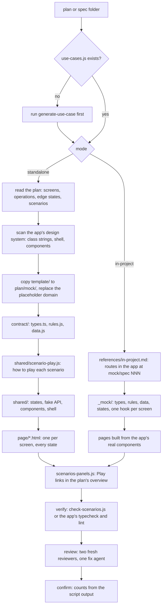
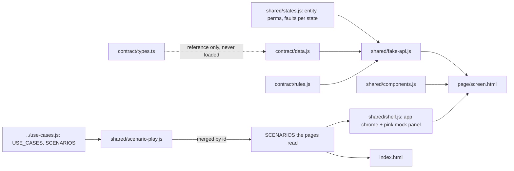
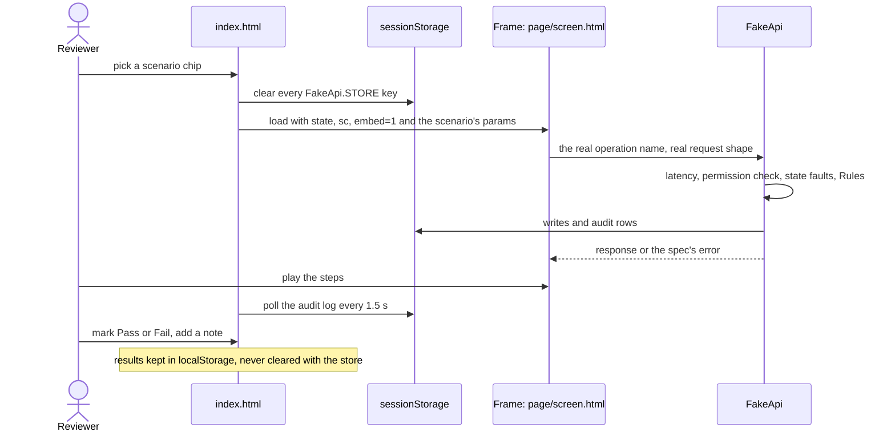
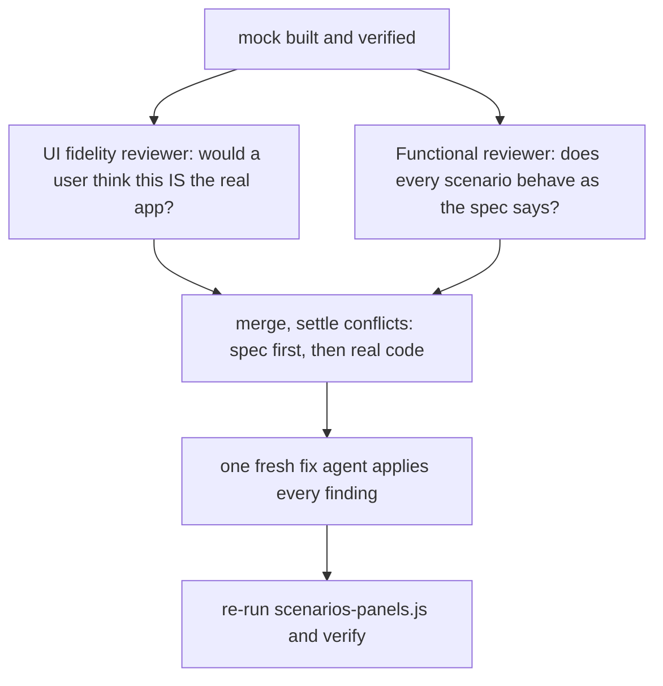

# generate-mock-ui

Builds a clickable mock of a planned feature in the app's real design system, with a fake API and every edge state, where a reviewer plays each scenario and marks Pass / Fail.

## When to use it

- You have a feature plan or spec, and you want to click through its screens before the backend exists.
- You want every edge state (empty, refused, unreachable, timeout) on its own link.
- You want a frontend contract (`types.ts`, `rules.js`, `data.js`) the real build can follow.
- Say: "mock UI for spec 127", "clickable prototype".

| You want | Use instead |
|----------|-------------|
| The full plan: use cases, diagrams, database and API changes | `design-feature` |
| The use cases and scenarios themselves | `generate-use-case` |
| Play the scenarios on the real running app, with real data | `play-scenarios` |
| Automated browser tests with screenshots | `e2e-test` |
| A test case file an AI runs later | `generate-test-cases` |
| One flowchart, sequence or ER diagram | `generate-diagram` |

## How it works

Two modes. Standalone is a plain HTML folder that opens from disk. In-project writes mock routes inside the real frontend app.



What loads what in a standalone mock. Every rule runs through `rules.js`, so the mock is never looser or stricter than the spec:



One scenario pick on the index:



The review step, from `references/mock-review.md`:



Rules the diagrams don't show:

- Standalone opens from `file://`: classic `<script src>` only, no modules, no `fetch()`, data as `.js` globals.
- Use cases and scenarios are read-only here. A wrong one is fixed with `generate-use-case`.
- Every count reported comes from `check-scenarios.js` (or `scenarios-panels.js` in-project), never by eye.
- In-project writes only inside `mock/spec<NNN>/`: no API or RPC calls, no edits to other app files.
- Run by `design-feature`: the review is skipped here, since design-feature runs it after its own checks.

## Input → output

Input: `<plan-folder | spec-folder> [frontend-app-path] [standalone | in-project]`

- A plan folder from `design-feature`, or a spec folder (the plan goes in `<spec-folder>/plan/`).
- `<plan>/use-cases.js` must exist. If it doesn't, the agent runs `generate-use-case` first.
- No mode given: the agent asks; in-project is recommended when a frontend app is found.

Output, standalone:

```
<plan>/
├── use-cases.js            read only; written by generate-use-case
├── overview.html           when it exists: Scenarios views get Play links
└── mock/
    ├── README.md           how to open and use the mock, for teammates
    ├── index.html          one block per use case: scenario list, framed screen, guide, results, audit log
    ├── contract/
    │   ├── types.ts        real shapes to implement; never loaded by pages
    │   ├── rules.js        spec rules as pure functions
    │   └── data.js         realistic data in the upstream shapes
    ├── page/
    │   ├── <screen>.html   one per screen; state from ?state=
    │   └── console.html    MCP / API client, only when the feature has one
    └── shared/
        ├── scenario-play.js  how to play each scenario, keyed by id
        ├── fake-api.js     the real operation names, served from contract/
        ├── components.js   the app's component class strings
        ├── shell.js        the app's chrome + the mock-only panel
        └── states.js       pages + mock states
```

Output, in-project:

```
<routes-root>/mock/spec<NNN>/
├── page.tsx                index: scenarios grouped by use case
├── <screen>/page.tsx       one route per screen; state from ?state=
└── _mock/                  types.ts, rules.ts, data.ts, states.ts, use-cases.ts,
                            scenario-play.ts, use<Screen>.ts, StatePanel.tsx
```

## Files in the skill folder

| Path | What |
|------|------|
| [SKILL.md](SKILL.md) | The agent's instructions; standalone mode |
| [references/in-project.md](references/in-project.md) | In-project mode: mock routes inside the real app |
| [references/mock-review.md](references/mock-review.md) | The review: two fresh reviewers, then one fix agent |
| [scripts/check-scenarios.js](scripts/check-scenarios.js) | Syntax-checks every script, matches play entries to scenarios, runs console scenarios against the fake API |
| [template/](template/) | The standalone `mock/` folder on a placeholder domain; copied whole and filled in per feature |
| [template/README.md](template/README.md) | Ships as `mock/README.md` |
| [use-cases.js](use-cases.js) | Example use cases for the template preview; never copied |

## Related skills

- `generate-use-case`: writes the `use-cases.js` this skill plays.
- `design-feature`: makes the plan folder that holds `mock/`, and runs the mock review.
- `play-scenarios`: the same layout, on the real running app with real data.
- `e2e-test`: plays the same flows as automated browser tests.
- `generate-test-cases`: reads the same `use-cases.js`.
