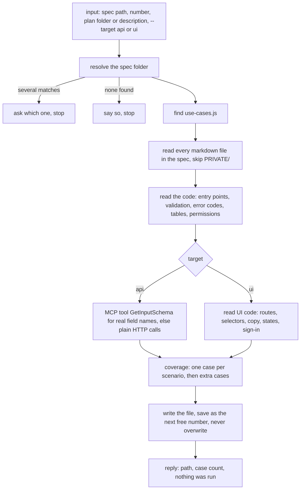
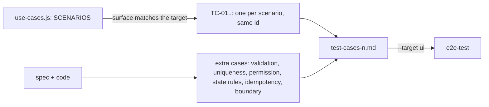

# generate-test-cases

Writes a markdown test case file that an AI runs later, through MCP tools, API calls or the web UI, from a spec or a feature. It never runs a test.

## When to use it

- You want test cases for a feature, to run in a later request.
- You want browser test cases (`--target ui`) that `e2e-test` turns into Playwright tests.
- Say: "test cases for spec 127", "write test cases", "test cases for 127 --target ui".

| You want | Use instead |
|----------|-------------|
| Write and run browser tests, with a screenshot per step | `e2e-test` |
| Play the scenarios by hand on the running app | `play-scenarios` |
| The use cases and scenarios themselves | `generate-use-case` |
| Check after a deploy that services reach each other | `smoke-test` |

## How it works

Eight steps. The spec plus the code it names is the only source; it never reads git changes.



Where the test cases come from:



Rules the diagrams don't show:

- Every step names a real operation (`AppEnvVarService → Create`); every expectation is an exact value or error code.
- Every write case reads its data back; every negative case checks nothing was written.
- Destructive cases are marked `⚠️ writes data`. No secrets in the file.
- Test data uses the prefix `TEST_AI_` (`__e2e_` for `--target ui`), so cleanup can find it.
- Spec and code disagree → follow the spec and mark the case `⚠️ spec/code mismatch`.
- `--target ui`: one user action or one check per step, controls named from a Selectors table, waits on state, not time.

## Input → output

Input: `<spec-folder | spec number | plan-folder | feature description> [--target api|ui]` (default `api`).

Output: one markdown file. It holds a header, coverage tables, preconditions, test data, the test cases, cleanup and a summary table.

```
<spec-path>/PRIVATE/test/
├── test-cases-<n>.md         --target api, next free number
└── test-cases-ui-<n>.md      --target ui, its own numbering
```

No spec folder (a feature description) → `test-cases/<feature-slug>/` at the repo root, and it asks once whether to gitignore it.

## Files in the skill folder

| Path | What |
|------|------|
| [SKILL.md](SKILL.md) | The agent's instructions and the exact file format |
| [references/ui-target.md](references/ui-target.md) | `--target ui` additions: UI code to read, UI coverage, the UI case format, Selectors table |

## Related skills

- `generate-use-case`: its scenarios become test cases with the same id.
- `e2e-test`: runs this skill with `--target ui`, then writes and runs Playwright tests from the file.
- `play-scenarios`: plays the same scenarios by hand.
- `design-feature`: its plan folder is a valid input.
