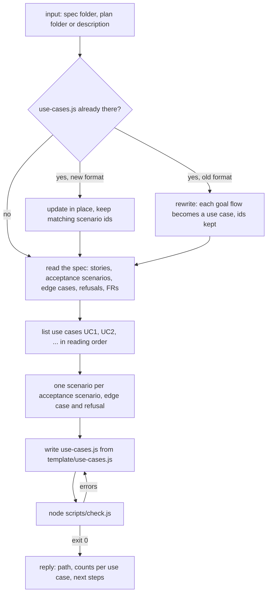
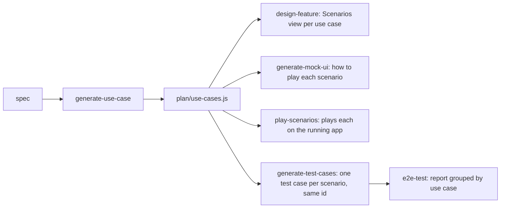
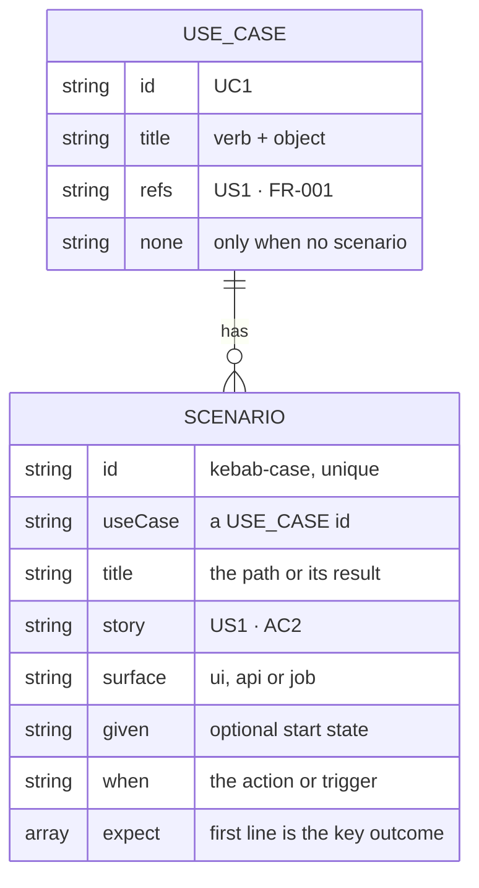

# generate-use-case

Writes a feature's use cases (one per user goal) and their scenarios (one per path and result) to one `use-cases.js` file that other skills read.

## When to use it

- You have a spec or an idea, and you want the list of what users can do and what they should see.
- You are about to plan, mock, play or test a feature: those skills read this file and never write their own.
- An old `use-cases.js` (`USE_CASE_FLOWS`) needs moving to the new format.
- Say: "use cases for spec 127", "list the use cases".

| You want | Use instead |
|----------|-------------|
| The full feature plan with flows, database and API | `design-feature` |
| A clickable mock where you play each scenario | `generate-mock-ui` |
| Play the scenarios by hand on the running app | `play-scenarios` |
| A test case file an AI runs later | `generate-test-cases` |
| Automated browser tests with screenshots | `e2e-test` |

| Word | Meaning | Example |
|------|---------|---------|
| Use case | One goal a user wants to reach, verb + object | Cut a new version |
| Scenario | One path through a use case, with one result | Merge request already released |

## How it works

Four steps. `check.js` gates the file before the reply.



Who reads the file:



The data in the file:



Rules the diagrams don't show:

- Both arrays are strict JSON after `var NAME = `, so a page on `file://` loads the file with `<script src>` and a script parses it.
- Every scenario comes from the source. Unknown copy → `TBD`. Never invented behaviour.
- No mock or test details: no state ids, pages, selectors or mock data.
- Ids are stable. Other files link to `#sc-<scenario id>`.
- Every count in the reply comes from `check.js`.

## Input → output

Input: `<spec-folder | plan-folder | feature description> [output-folder]`

| Input | Where the file goes |
|-------|---------------------|
| Output folder given | that folder |
| Plan folder (has `overview.html`) | the plan folder |
| Spec folder or number | `<spec-folder>/plan/` |
| Feature description | `plans/<feature-slug>/` at the project root |

Output: one file.

```
<plan>/
└── use-cases.js       var USE_CASES = [...]; var SCENARIOS = [...]
```

## Files in the skill folder

| Path | What |
|------|------|
| [SKILL.md](SKILL.md) | The agent's instructions |
| [template/use-cases.js](template/use-cases.js) | Example file: 3 use cases, 11 scenarios across `ui`, `api` and `job` |
| [scripts/check.js](scripts/check.js) | Checks the file and prints the scenario count per use case; `--json` for machine output; exit 1 on any error |

## Related skills

- `design-feature`: shows the scenarios in each use case's Scenarios view.
- `generate-mock-ui`: makes each scenario playable in the mock.
- `play-scenarios`: plays each scenario on the running app.
- `generate-test-cases`: writes one test case per scenario, same id.
- `e2e-test`: groups its report by these use cases.
