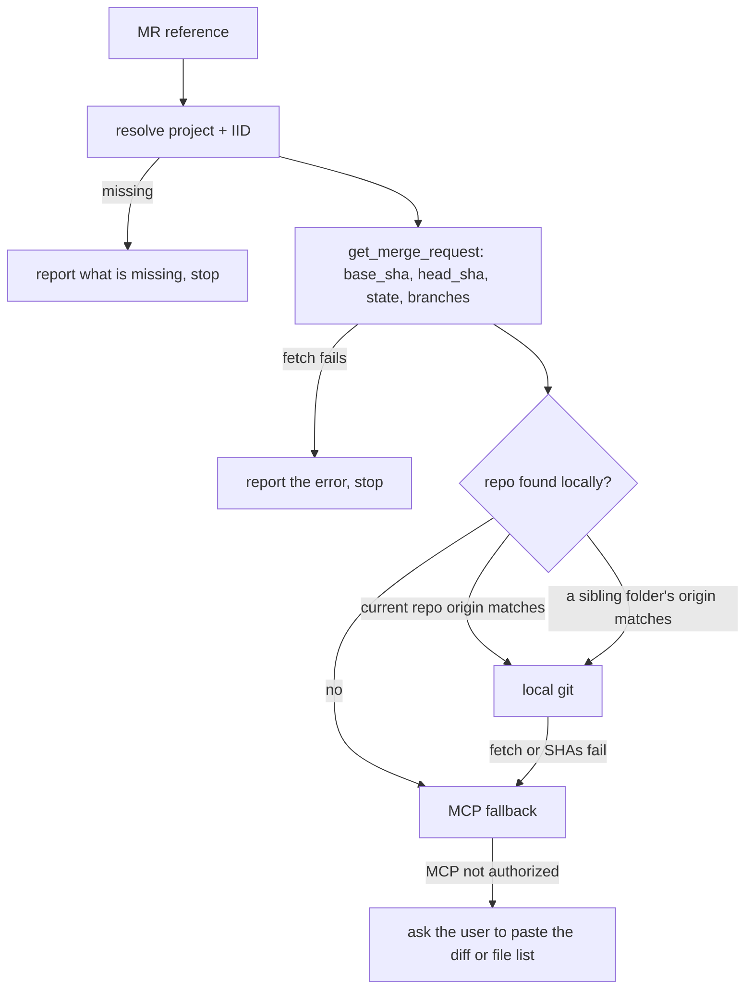
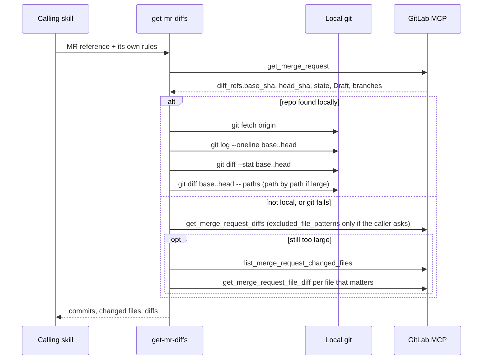

# get-mr-diffs

Helper that fetches a GitLab merge request's real diff: local git first, else the GitLab MCP server.

## When to use it

- Not for direct use. Other skills call it when they need an MR's changes.
- Called by `review-code`, `generate-changelog`, `announce` and `update-merge-request`.
- The caller may add its own rules on top, e.g. noise-file filters or "never exclude test files".

| You want | Use instead |
|----------|-------------|
| A review of the MR's changed lines | `review-code` |
| A copy-paste changelog of the MR | `generate-changelog` |
| A new MR title and description, saved to the MR | `update-merge-request` |
| A Thanos announcement drafted from the MR | `announce` |

## How it works

Pick the source: local git when the repo is on disk, else MCP.

The calls, local path and fallback:

Rules the diagrams don't show:

- Everything is scoped to `base_sha..head_sha`, never the whole branch. The branch tip may be ahead of the MR head.
- The MR title and description are metadata only, not a content source, unless the caller says so.
- The local search stops at sibling folders of the current repo's parent folder.

## Input → output

Input: one MR reference.

| Form | Example |
|------|---------|
| Full MR URL | `https://<host>/<group>/<project>/-/merge_requests/<iid>` |
| `<project_id>!<iid>` | `avengers/thanos!123`, `456!123` |
| `!<iid>` or `<iid>` | MR in the current repo, project from `git remote` |

Output: no file. The MR metadata, commits, changed files and diffs, handed back to the calling skill.

## Files in the skill folder

| Path | What |
|------|------|
| [SKILL.md](SKILL.md) | The agent's instructions |

## Related skills

- `review-code`: reviews the diff this skill fetches (MR mode).
- `generate-changelog`: turns the diff into a changelog.
- `update-merge-request`: rewrites the MR title and description from the diff.
- `announce`: drafts a Thanos announcement from the diff.
