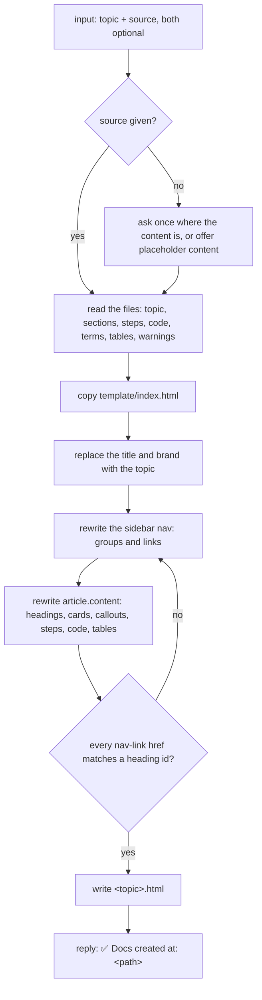

# html-document

Generates one self-contained HTML docs page, dark only, with a sidebar, section search and a text size picker, from files or a topic.

## When to use it

- You have markdown, a `docs/` folder or a topic, and want one styled page to share or open offline.
- You want readers to jump between sections from a sidebar and filter them by name.
- Say: "make HTML docs for X", "turn this markdown into a docs page".

| You want | Use instead |
|----------|-------------|
| A slide deck, one click per slide | `html-presentation` |
| A plain-words guide for end users, in markdown | `user-guide` |
| A full feature plan: use cases, flows, database and API changes | `design-feature` |
| One flowchart, sequence or ER diagram | `generate-diagram` |

## How it works

The agent copies the template and changes only the content. Style and script stay as they are.



Rules the diagram doesn't show:

- One file. No external CSS, JS, fonts or images.
- Dark only. No light theme, no toggle.
- The text size picker (small 14px, normal 16px, big 18px) stays; default is normal. Text uses the `--fs-*` tokens, never fixed `px`.
- Colors use the theme tokens, never new hex values. Never edit between the `theme:` markers.
- The Export PDF button stays: it opens the print dialog, pick "Save as PDF".

## Input → output

Input: `<topic>` plus a source location, both optional.

- Source: a file, a folder or a `docs/` path the user points to.
- Output path: the one the user gave, else `<topic>.html` (kebab-case) at the project root, else `docs.html`.

Output:

```
<project root>/
└── <topic>.html     the docs page: sidebar nav with search, active-section highlight, A / A / A text size, Export PDF
```

The page remembers the picked text size in the browser.

## Files in the skill folder

| Path | What |
|------|------|
| [SKILL.md](SKILL.md) | The agent's instructions |
| [template/index.html](template/index.html) | The docs page with sample content; copied, then its content replaced |

## Related skills

- `html-presentation`: the same theme, as slides.
- `user-guide`: an end-user guide in markdown, which this skill can turn into a page.
- `design-feature`: a browsable plan folder for a feature.
