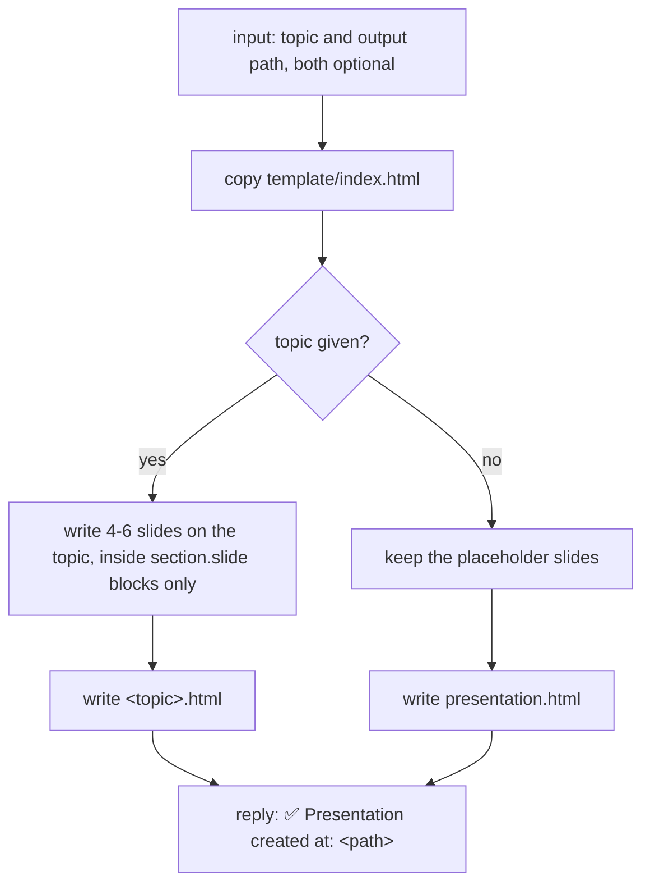
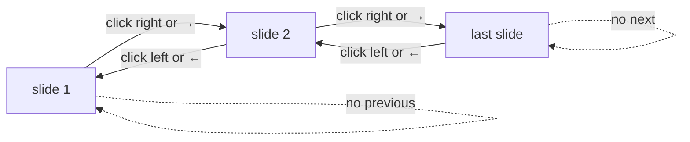

# html-presentation

Creates one self-contained HTML slide deck, dark only, that fills the window and moves one slide per click.

## When to use it

- You want a few slides about a topic to show from a browser, with no slide tool.
- You want one file you can send, open offline, or save as a PDF.
- Say: "make HTML slides about X", "build a presentation", "make a slideshow".

| You want | Use instead |
|----------|-------------|
| A scrolling docs page with a sidebar and search | `html-document` |
| A plain-words guide for end users, in markdown | `user-guide` |
| A clickable mock of app screens | `generate-mock-ui` |
| One flowchart, sequence or ER diagram | `generate-diagram` |

## How it works

The agent copies the template and edits only the text inside each slide.



How the viewer moves through the deck:



Rules the diagrams don't show:

- The stage fills the whole window: no max width, no letterbox.
- Slides change with a fade. A counter shows the current slide and the total.
- One file. No external CSS, JS or images.
- Dark only. Colors use the theme tokens, never new hex values. The navigation script and layout CSS stay as they are.
- The Export PDF button makes one 16:9 page per slide.

## Input → output

Input: `<topic>` or `<topic> <output-path>`, both optional.

- No topic: placeholder slides.
- Output path: the one the user gave, else `<topic>.html` (kebab-case) at the project root, else `presentation.html`.

Output:

```
<project root>/
└── <topic>.html     the deck: 4-6 slides, click or arrow keys to move, Export PDF
```

## Files in the skill folder

| Path | What |
|------|------|
| [SKILL.md](SKILL.md) | The agent's instructions |
| [template/index.html](template/index.html) | The deck with placeholder slides; copied, then the slide text replaced |

## Related skills

- `html-document`: the same theme, as a scrolling docs page.
- `user-guide`: an end-user guide in markdown.
