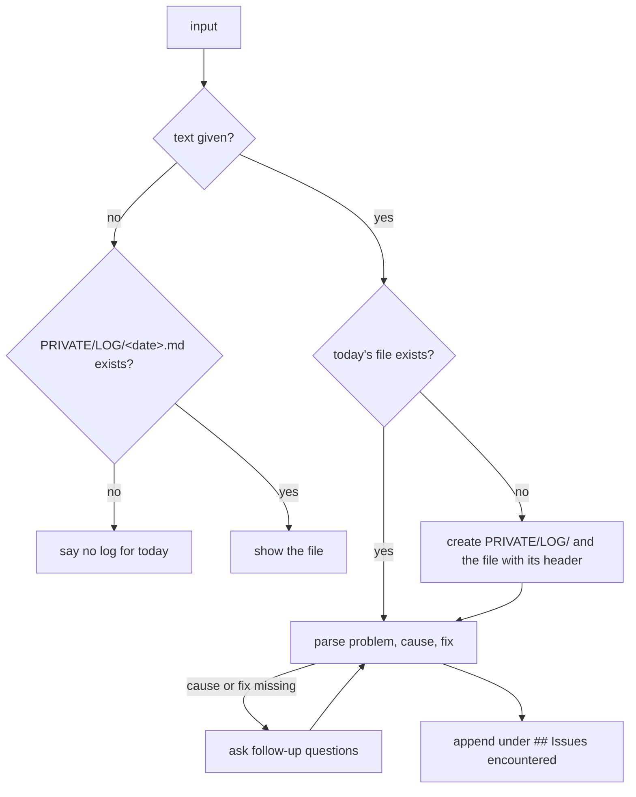

# issue-log

Logs a troubleshooting issue (problem, cause, fix) to today's private log file, or shows today's log.

## When to use it

- You just solved a problem and want to keep the problem, cause and fix.
- You want to read back what you logged today.
- Say: "log this issue", "show today's log".

| You want | Use instead |
|----------|-------------|
| Why a Jenkins build failed | `check-job` |
| Weekly achievements from your commits | `weekly-work-log` |
| A user guide for a feature | `user-guide` |

## How it works

With text, it appends an entry. Without text, it shows today's file.



## Input → output

Input: `<problem description>`, or nothing to view today's log.

Output: one file per day, relative to where the agent runs.

```
PRIVATE/
└── LOG/
    └── <YYYY-MM-DD>.md    "# <date> — Troubleshooting Log", then one ### entry per issue
                           with Problem, Cause and Fix bullets
```

## Files in the skill folder

| Path | What |
|------|------|
| [SKILL.md](SKILL.md) | The agent's instructions and the entry format |

## Related skills

- `check-job`: finds the cause of a failed build, ready to log.
- `weekly-work-log`: the weekly summary, from git instead of a log.
