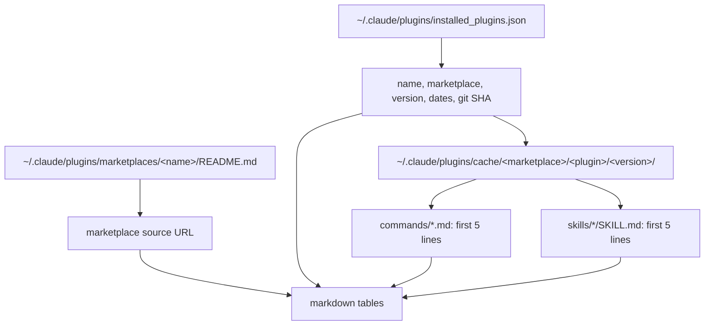

# list-plugins

Lists the installed Claude Code plugins and marketplaces, with versions, skills and commands.

## When to use it

- You want to see which plugins and versions are installed.
- You want each plugin's skills and commands with their descriptions.
- Say: "list my plugins", "what plugins are installed".

| You want | Use instead |
|----------|-------------|
| A styled HTML page about a topic | `html-document` |
| A user guide for a feature | `user-guide` |

## How it works

Reads the local Claude Code plugin folders only. It changes nothing.



## Input → output

Input: none.

Output: a chat reply.

```
## Marketplaces            table: Marketplace | Source
## Installed Plugins
### <plugin> (from <marketplace>)
    Version, Installed, Last updated, Git commit
    #### Commands           table: Command | Description
    #### Skills             table: Skill | Description
```

## Files in the skill folder

| Path | What |
|------|------|
| [SKILL.md](SKILL.md) | The agent's instructions and the output format |

## Related skills

- None. It reads plugins; it does not use other skills.
