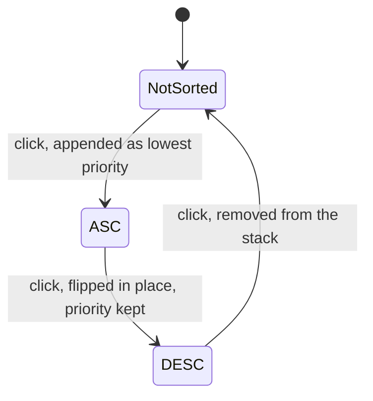
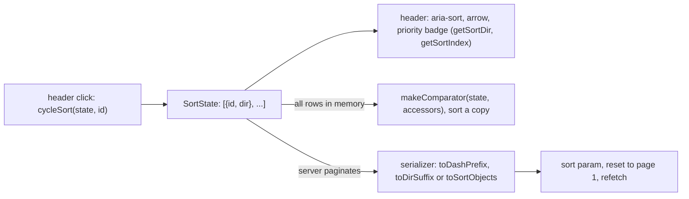

# multi-column-sort

Adds multi-column table sorting to a project: every header cycles through three states, and sorted columns stack by priority.

## When to use it

- A table needs sorting on more than one column at once.
- You want one sort state that works for client-side sorting, a server sort parameter, or both.
- Say: "sort by several columns", "multi-sort".

| You want | Use instead |
|----------|-------------|
| A clickable mock of the table screen | `generate-mock-ui` |
| A review of the sort code once written | `review-code` |
| Browser tests for the table | `e2e-test` |

## How it works

Each header click moves that column one step. The state is an ordered list; its order is the priority.



One `SortState`, two ways to use it:



Rules the diagrams don't show:

- Append on add is the default. If the product wants the newest click as the primary key, the agent says so before it prepends.
- Never mutate: sort `[...rows]`, not `rows`.
- `compareValues` puts null and undefined last, and compares numbers, strings (locale-aware), booleans and dates.
- Column ids must match the accessor keys and the server field names, or pass a `FieldMap` to the serializer.
- The header is a `<button>`, and there is a way to clear all sorts.

## Input → output

Input: a request in your project, e.g. "multi-sort the users table".

Output: edits in your project. Names and paths follow the project's own style.

```
<your project>/
├── <utils>/sort-core.ts            copied from reference/, adapted
├── <utils>/server-serializers.ts   only when the backend sorts; keep the one serializer you need
└── <table component>               holds SortState, wires each header, consumes the state
```

## Files in the skill folder

| Path | What |
|------|------|
| [SKILL.md](SKILL.md) | The agent's instructions: behavior, client and server use, header UI, gotchas |
| [reference/](reference/) | Code the agent copies into the project |
| [reference/sort-core.ts](reference/sort-core.ts) | Types, `cycleSort`, `getSortDir`, `getSortIndex`, `clearSort`, `compareValues`, `makeComparator`; no dependencies |
| [reference/server-serializers.ts](reference/server-serializers.ts) | `toDashPrefix`, `toDirSuffix`, `toSortObjects`, with an optional `FieldMap` |

## Related skills

- `generate-mock-ui`: mock the sortable table before you build it.
- `review-code`: review the change.
- `e2e-test`: test the header clicks in a browser.
