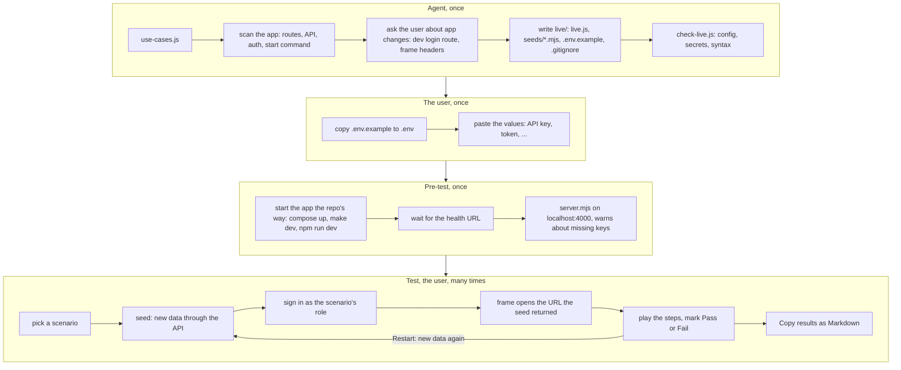
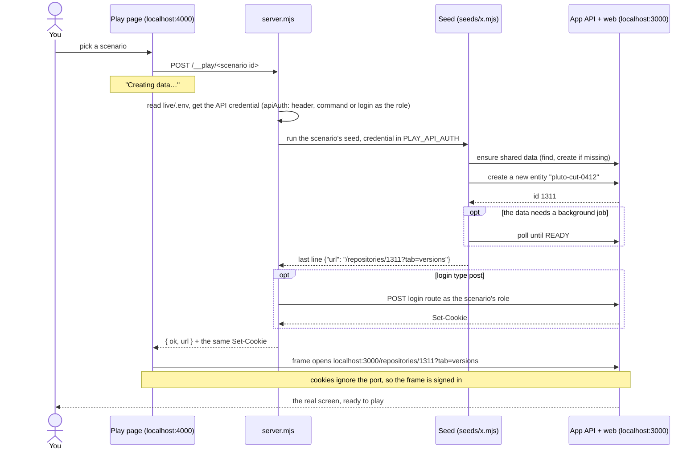
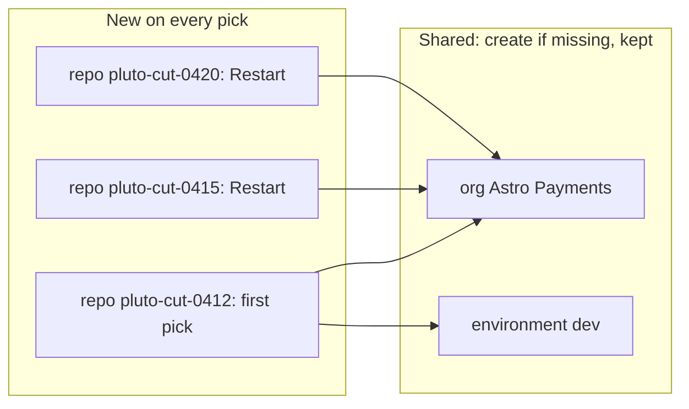
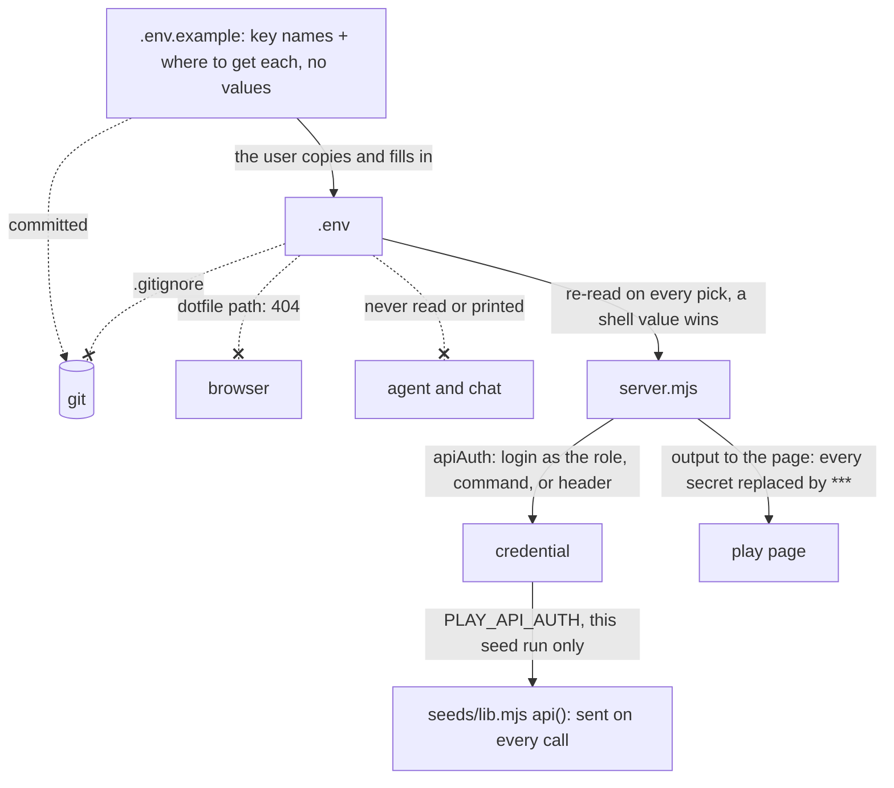

# play-scenarios

Builds a local page where you play a feature's scenarios by hand on the real running app, with Pass / Fail per scenario.

## When to use it

- You have a feature's use cases and scenarios, and you want to try each one on your local app.
- You want fresh test data for every try, made through the app's own API.
- Say: "play the scenarios on my local app", "test spec 127 by hand".

| You want | Use instead |
|----------|-------------|
| A clickable mock with fake data, no app running | `generate-mock-ui` |
| Automated browser tests with screenshots | `e2e-test` |
| A test case file an AI runs later | `generate-test-cases` |
| Checks that services reach each other after a deploy | `smoke-test` |
| The use cases and scenarios themselves | `generate-use-case` |

## How it works

Four phases. The agent builds the page once, you fill in `.env` once, the pre-test starts the app, then you play any scenario many times.



One pick, step by step:



What a seed creates:



- Read-only scenarios use only shared data (or none), so their picks are fast.
- Writing scenarios get a new entity on every pick. Restart never deletes; it creates again.
- The seed returns the URL, so no id is written in `live.js` or the steps.

Where secrets live, and what keeps them private:



Rules the diagrams don't show:

- Local only. `server.mjs` refuses a non-local app unless you pass `--allow-remote` for a dev environment you own.
- Seeds call the app's API only. No SQL, no database client.
- The agent asks before it changes the app (a dev login route, a dev-only frame header).

## Input → output

Input: `<plan-folder | spec-folder> [base-url] [app-repo-path]`

- A plan folder from `design-feature`, or a spec folder (the plan goes in `<spec-folder>/plan/`).
- `<plan>/use-cases.js` must exist. If it doesn't, the agent runs `generate-use-case` first.

Output:

```
<plan>/
├── use-cases.js           read only; written by generate-use-case
└── live/
    ├── README.md          how to run the page, for teammates
    ├── index.html         the play page: one block per use case, framed app, Pass / Fail, results
    ├── live.js            LIVE_CONFIG (app, API, pre-test, login) + LIVE_PLAY (one entry per scenario)
    ├── server.mjs         local server: pre-test, seed, sign in, serve the page
    ├── .env.example       secret key names and where to get each; no values
    ├── .gitignore         lists .env
    └── seeds/
        ├── lib.mjs        api(), ensure(), unique(), poll(), done()
        └── <name>.mjs     one seed per kind of data a scenario needs
```

## Files in the skill folder

| Path | What |
|------|------|
| [SKILL.md](SKILL.md) | The agent's instructions |
| [scripts/check-live.js](scripts/check-live.js) | Checks `live/` against `use-cases.js`; `--run-seeds` picks every seeded scenario twice |
| [template/](template/) | The `live/` folder, working against a stand-in app; copied and filled in per feature |
| [template/README.md](template/README.md) | Ships as `live/README.md` |
| [template/preview/](template/preview/) | Stand-in app and fake API for the template; not copied |
| [use-cases.js](use-cases.js) | Example use cases for the template preview; never copied |

## Related skills

- `generate-use-case`: writes the `use-cases.js` this skill plays.
- `design-feature`: makes the plan folder that holds `live/`.
- `generate-mock-ui`: the same layout, with fake data and no app.
- `e2e-test`: plays the same flows as automated browser tests.
