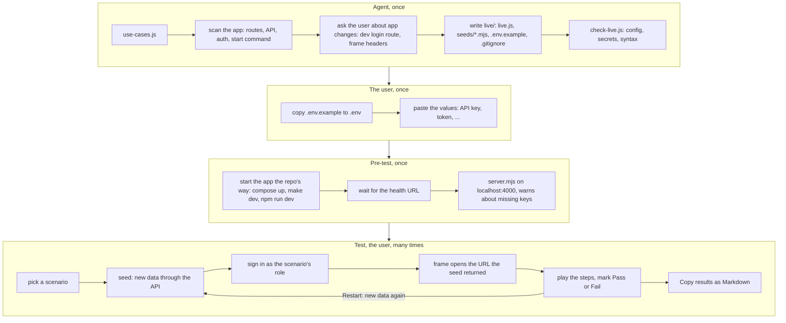
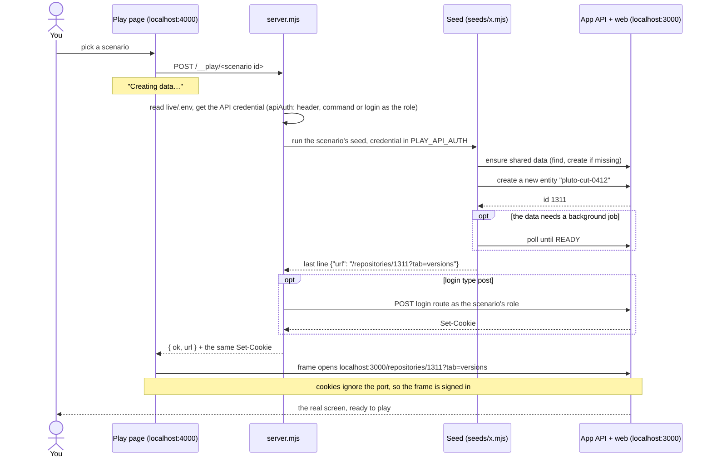
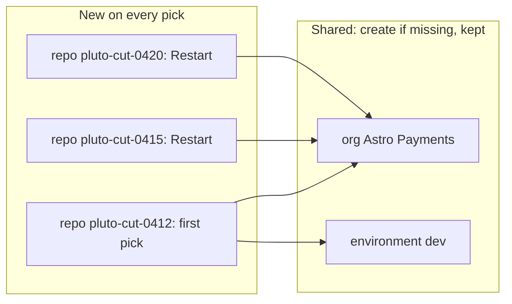
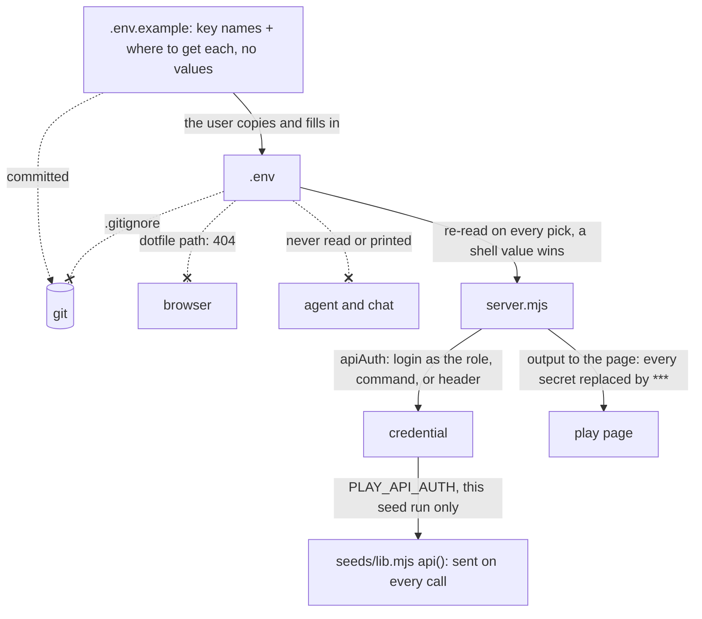

# Play Scenarios

Play each scenario of a feature on the running app, by hand. The page looks like the mock UI's index: one block per **use case**, a side list of its **scenarios**, the picked one in a 16:9 frame, and a guide beside it (Result, How to play, What you should see). The difference: the frame is the real app, and each pick first **seeds** new data for that scenario by calling the app's API.

The use cases and scenarios are not written here. They live in `<plan>/use-cases.js`, written by the `generate-use-case` skill (`naphatwx-tools:generate-use-case` in Claude Code). This skill only adds how to play each one on the real app.

It is generic: it needs a way to start the app, a health URL and an HTTP API. It needs no seed framework, no database access and no change to the app's code, except a dev login route when the app has none (step 3).

```
<plan>/use-cases.js        USE_CASES + SCENARIOS (generate-use-case); read-only here
live/
├── index.html             one block per use case: side list, framed app, guide with Pass / Fail; results table
├── live.js                LIVE_CONFIG (app, API, pre-test, login) + LIVE_PLAY (seed, url, role, steps per scenario)
├── server.mjs             serves the plan folder on localhost; runs the pre-test; on each pick: seed, sign in, return the URL
├── .env.example           every secret key the play needs, with where to get it; no values (committed)
├── .env                   the user pastes the values here (git-ignored, never served, never read by the agent)
├── .gitignore             lists .env
└── seeds/
    ├── lib.mjs            api(), ensure(), unique(), poll(), done({ url })
    └── <name>.mjs         one seed per kind of data a scenario needs; ends by printing {"url": "/..."}
```

`template/` already has this working against a stand-in app (`template/preview/`): copy it and fill it in, don't rebuild it. Its index reads `../use-cases.js`, which is this skill's `use-cases.js` (preview data only; never copy it).

## How it works

Four phases. The agent builds the page once, the user fills in `.env` once, the pre-test starts the app once, then the user plays any scenario any number of times:



One pick, step by step:



What a seed creates:



- Read-only scenarios only use shared data (or none), so their picks are fast.
- Writing scenarios get a new entity on every pick, so every play starts clean. Restart never deletes anything; it creates again.
- The seed returns the URL, so no id is ever written in `live.js` or the steps.

Where secrets live, and what keeps them private:



## User Input

```text
$ARGUMENTS
```

If `$ARGUMENTS` above is not filled in (agents other than Claude Code), use the text the user gave with this request as the input.

**Expected format:** `<plan-folder | spec-folder> [base-url] [app-repo-path]`

- Plan folder (has `overview.html`, from the `design-feature` skill) → `<plan>` is the plan folder. Write `<plan>/live/`.
- Spec folder only → `<plan>` is `<spec-folder>/plan/`. Write `<plan>/live/`.
- `<plan>/use-cases.js` missing → run the `generate-use-case` skill with the same input first. Never write use cases or scenarios here.
- No base URL → read the app's dev config (compose file, `package.json` dev script, `.env`) for its local web port, or ask once (use AskUserQuestion when the agent has it).
- No app repo path → the repo that holds the plan folder, when it has the app; otherwise ask once.

## Hard Rules

1. **Local only.** `server.mjs` listens on localhost and refuses a non-local `base` unless the user passes `--allow-remote` for a dev environment they own. Never point it at staging or production.
2. **Seeds call the app's API only.** No SQL, no database client, no app internals: the API applies the app's own validation, permissions and events, so seeded data looks like real data.
3. **Writing scenarios get new data on every pick** (`unique(name)`); shared and read-only data uses `ensure()` (find, create if missing). A seed never deletes.
4. **Every seed ends with one JSON line** `{"url": "/..."}`, the path to open relative to `base`. No id is hardcoded in `live.js` or the steps; steps name things (`the new pluto repo`), not ids.
5. **Commands come from `live.js` only.** The server reads them by scenario id; the page never sends one. Keep the `X-Play` header check: it stops other sites from triggering a pick.
6. **Secrets live only in `live/.env`.** The agent writes `.env.example` (keys, no values) and never reads, prints or writes `.env`; `live.js`, seeds and output name keys, never values. `.env` stays git-ignored (`.gitignore` next to it), the server never serves a dotfile, and it hides every `.env` value and credential in output shown on the page.
7. **Same host name as the app** (`localhost` or `127.0.0.1`, never mixed), so login cookies reach the frame.
8. **Use cases and scenarios are data, owned by `<plan>/use-cases.js`.** `LIVE_PLAY` has exactly one entry per scenario, same id, same order. A wrong or missing scenario → fix it with the `generate-use-case` skill.
9. **`live.js` is strict JSON** (double quotes, no trailing commas, no comments inside the values).
10. **Every count you report is computed** (by `scripts/check-live.js`), never estimated.
11. **Ask before you change the app.** A dev login route or a dev-only frame header is a change to the user's repo: list it and get a yes first. Seeds live in `<plan>/live/seeds/` and change nothing in the app.
12. No absolute local paths in any file (`appDir` is relative to `live/`). Code comments max 3 lines. Wrap every `localStorage` call in `try/catch`.

## Workflow

### 1. Read the feature

- From the plan folder: `overview.html` (scope, screens, errors) and `use-cases.js`.
- When `<plan>/mock/shared/scenario-play.js` exists, it has each scenario's screen, params and steps. Start from it; names and values change to the seeded ones.
- List per scenario: the screen and route, the data it needs, whether it **writes** (creates or changes data) or only reads, and the role it runs as.

### 2. Scan the app

Delegate to a read-only sub-agent when the agent can. Ask for concrete answers with `file:line`:

- **Start**: how the repo starts locally, as its docs say (`docker compose up -d`, `make dev`, `npm run dev`). Follow the repo's rules (e.g. "everything runs in Docker"). The web port, the API origin, a health route.
- **API**: the create / read / update calls for every entity the scenarios need, their request shapes, validation (name length and characters, for `unique()`), and which states only a background job reaches (`PENDING → READY`).
- **API auth**: how a script authenticates (API key header, service token, dev login). The env var that holds it.
- **UI login**: a dev login route? Its method and shape (GET link or POST body), and the roles it accepts.
- **Routes**: the URL of each screen, and the params that set a filter, tab or open a form.
- **Framing**: `X-Frame-Options` or CSP `frame-ancestors` in dev.
- **Existing seed tools**: when the repo has one that works over the API, reading it shows the right calls; reuse its patterns, but the play seeds stay in `live/seeds/`.

### 3. Agree the app changes

- Usually none. List any that are needed and wait for a yes (Hard Rule 11):
    - No dev login route → offer one (dev-only, off in production), or use login type `manual`.
    - A frame header blocks the page → a dev-only relaxation.
- A scenario needing data the API can't create (e.g. no "create user" call) → `skip` with the reason, unless the user agrees to another way.

### 4. Copy the template

- Copy `template/` → `<plan>/live/`, without `preview/`. In `seeds/lib.mjs`, delete the `API === 'preview'` line.
- Replace the example seeds in `seeds/` with the feature's own.
- Set the page title and `<h1>` to the feature name.
- `LIVE_CONFIG`:

| Field | What |
|-------|------|
| `slug` | feature slug; keys the saved results |
| `base` | the app's web origin, e.g. `http://localhost:3000` |
| `api` | the API origin seeds call, e.g. `http://localhost:3000/api` |
| `apiAuth` | how seeds authenticate to the API, below; `null` when the API is open |
| `appDir` | the app repo root, relative to `live/`; `pretest.up` runs there |
| `pretest` | `up`: the repo's start command (`""` when the user starts it); `health`: a path that answers when the app is up; `timeoutSec` |
| `login` | how the frame signs in, below |
| `role` | default role for scenarios without their own |
| `seedTimeoutSec` | per seed; default 180 |

`apiAuth.type`, in order of preference. Prefer the one that makes the seed act as the **same role the frame signs in as**: a system key can create records the frame's user can't see or change.

| Type | When | Shape |
|------|------|-------|
| `login` | the app's dev login (`login.type` link or post) gives a session the API accepts | `{ "type": "login", "cookie": "access_token" }` sends that cookie as `Authorization: Bearer`; `"send": "cookie"` sends the whole Cookie header; `"header"` / `"prefix"` change where it goes |
| `command` | a CLI the dev is signed in to prints a token | `{ "type": "command", "run": "gh auth token" }`; run in `appDir` on each pick; `header` (default `Authorization`) and `prefix` (default `Bearer `) |
| `header` | a fixed service key or personal access token | `{ "type": "header", "header": "x-api-key", "env": "APP_API_KEY" }`; the value comes from `live/.env` |

`login.type`:

| Type | When | Shape |
|------|------|-------|
| `none` | the app has no login | `{ "type": "none" }` |
| `link` | a GET dev login route | `{ "type": "link", "path": "/dev/login?as={role}&next={next}" }` |
| `post` | a POST dev login route that sets a cookie | `{ "type": "post", "path": "/api/auth/dev-login", "body": { "role": "{role}" } }`; server.mjs posts it and passes the cookie on |
| `manual` | no dev route | `{ "type": "manual" }`; the user signs in once with Open ↗, and the frames share that session |

### 5. Write `LIVE_PLAY`

One entry per scenario in `<plan>/use-cases.js`, same `id`, same order:

| Field | What |
|-------|------|
| `id` | the scenario's id; becomes `#sc-<id>` in links |
| `seed` | `node seeds/<name>.mjs [args]`; prints `{"url"}`. Several scenarios share one seed with args |
| `url` | only for a scenario with no seed: a fixed path starting with `/` |
| `role` | optional role for this scenario (read-only user, another team) |
| `steps` | "How to play": imperative; name what the seed created (`the new pluto repo`, `merge request !159`) |
| `skip` | instead of the fields above, for a scenario you can't play live: one sentence saying why and where to play it instead |

- `title`, `story` and `expect` come from `use-cases.js`; the file's last lines merge both lists. Keep those lines as the template has them.
- Skip, with a reason: `api` and `job` scenarios with no screen (point to the `e2e-test` skill or an MCP client), and faults you can't cause safely on a dev machine (an upstream outage; point to the mock).
- A scenario whose `expect` doesn't match what the app should do → report it; don't change `use-cases.js`.

### 5b. List the secrets (`.env.example`)

- One key per secret or local setting a seed or `apiAuth` needs (API key, a token for an outside system the seeds read, a test bucket name).
- The comment line right above each key says what it is and where the user gets it locally (a file path in the app repo, a CLI command, a settings page). Put `Optional` in that comment when the play works without it.
- No values, not even examples that look real. Keep the template's `.gitignore` next to it.
- Tell the user which keys to fill in; never ask them to paste a secret into the chat.

### 6. Write the seeds

- Plain Node `.mjs`, importing only `./lib.mjs` and Node built-ins. They run on the host against `localhost`.
- Each one:
    - `ensure()` the shared data it depends on (org, environment, base records), by natural key.
    - Creates its scenario's own entity with `unique('<name>')` when the scenario writes.
    - Drives the data to the state the scenario starts from, through the same API calls a user or job would make; `poll()` for states a background job reaches.
    - Ends with `done({ url })`. Any failed call throws: the frame shows the output, so make messages say what failed.
- Never handle auth in a seed: `api()` already sends the credential server.mjs resolved. Never print an env value.

### 7. Verify

- `node <this skill dir>/scripts/check-live.js <plan>/live`: syntax of `live.js`, `server.mjs` and every seed; `live.js` as strict JSON; one entry per scenario in order; every playable entry has a seed or a url, and steps; login and roles consistent.
- Pre-test: `node <plan>/live/server.mjs --up`. It runs `pretest.up`, waits for `health`, warns about framing headers, and prints the page URL.
- `check-live.js` also checks the secrets: `.env.example` exists with no values, every `apiAuth.env` is listed in it, `.env` is git-ignored, and `live.js` holds nothing that looks like a secret. It names keys still empty, never values.
- With the app up, `.env` filled in and `server.mjs` running, `check-live.js <plan>/live --run-seeds [--server http://localhost:4000]`: picks every seeded scenario twice through the server, with the same `.env` and auth as playing. Both picks must succeed; a writing scenario must get a **new** URL each time (it prints which ones get the same).
- Open the page in a headless browser when one is available and pick every playable scenario: no console errors, the "Creating data…" cover clears, the frame shows the right screen signed in as the right role. Look at the screenshots.
- Grep for absolute local paths and secrets, and remove them.

### 8. Confirm

- Output: `✅ Play page created at: <plan>/live/index.html`
- Counts copied from `check-live.js`: scenarios, playable live, skipped, seed commands.
- App changes made (login route, headers), each with its path.
- The keys to fill in `live/.env`, each with where to get it (from `.env.example`).
- Skipped scenarios with their reasons.
- How to run it:
    1. Copy `live/.env.example` to `live/.env` and fill in the values. A value already set in the shell wins.
    2. `node <plan>/live/server.mjs --up` (starts the app, waits for it, serves the page). Without `--up` when the app is already running.
    3. Open the URL it prints. Pick a scenario, play it, mark Pass or Fail, then "Copy as Markdown" under Results.
