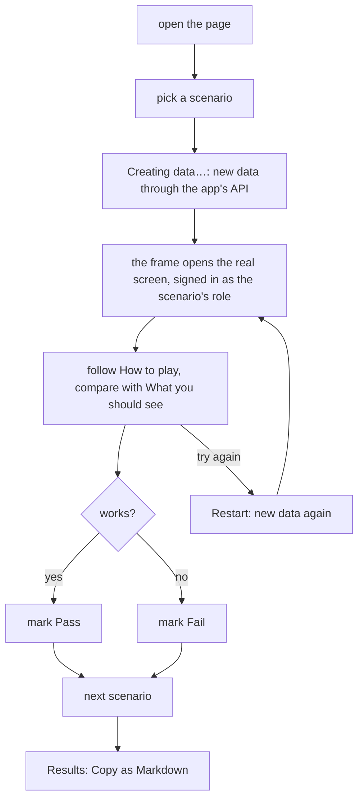

# Play scenarios

A local page to play this feature's scenarios by hand on the real running app, and mark each one Pass or Fail.

## How to run it

1. Copy the secrets file, then fill in the values. Each key's comment says where to get it.

    ```bash
    cp live/.env.example live/.env
    ```

2. Start the app and the play server, from the plan folder:

    ```bash
    node live/server.mjs --up
    ```

    - `--up` starts the app with its own start command and waits until it answers.
    - Leave out `--up` when the app is already running.
    - `--port 4000` changes the page port (4000 is the default).

3. Open the URL it prints, e.g. `http://localhost:4000/live/`.

## Using it



- Every pick of a writing scenario makes new data. Nothing is ever deleted.
- Pass / Fail marks stay in this browser.

## Files

| File | What |
|------|------|
| `index.html` | The play page: one block per use case, the framed app, Pass / Fail, results |
| `live.js` | The app's address, API, start command, login, and how to play each scenario |
| `server.mjs` | Local server: starts the app, runs seeds, signs in, serves the page |
| `.env.example` | Secret key names and where to get each; no values |
| `.env` | Your values; git-ignored, never served to the browser |
| `.gitignore` | Keeps `.env` out of git |
| `seeds/lib.mjs` | Helpers the seeds share: `api()`, `ensure()`, `unique()`, `poll()`, `done()` |
| `seeds/<name>.mjs` | One seed per kind of data; prints the URL to open |
| `../use-cases.js` | The use cases and scenarios this page plays |

## When it fails

| You see | Do this |
|---------|---------|
| `Opened from disk: seeds and sign-in do not run.` | Run `node live/server.mjs --up` and open the URL it prints. |
| `Missing in live/.env: …` | Copy `.env.example` to `.env` and fill in those keys. The next pick reads it; no restart needed. |
| `The app does not answer at …` | Start the app, or restart the play server with `--up`. |
| `Refusing to run seeds against …: base is not local.` | `live.js` points at a remote app. Point it at your local app, or pass `--allow-remote` for a dev environment you own. |
| `pre-test failed (exit …)` | The app's start command failed. Run it by hand in the app repo and fix the error. |
| `… did not answer in …s` | The app started but its health URL never answered. Check the app's logs. |
| `Warning: … sends X-Frame-Options` or `CSP frame-ancestors` | The app blocks the frame, so it stays blank. Relax that header in dev only. |
| `API credentials (…) failed: …` | The API key, token or dev login did not work. Check the key in `.env` or the command in `live.js`. |
| `SEED FAILED` / a seed error in the frame | A seed's API call failed. The message names the call and status; check the app's API and data. |
| `The seed did not end with a JSON line like {"url": "/..."}.` | The seed must end with `done({ url })`. |
| `Sign-in as … failed` | The dev login route refused that role. Check the role names in `live.js`. |
| Frame is blank, or signed out | Use the same host name as the app (`localhost` or `127.0.0.1`, not both). |
