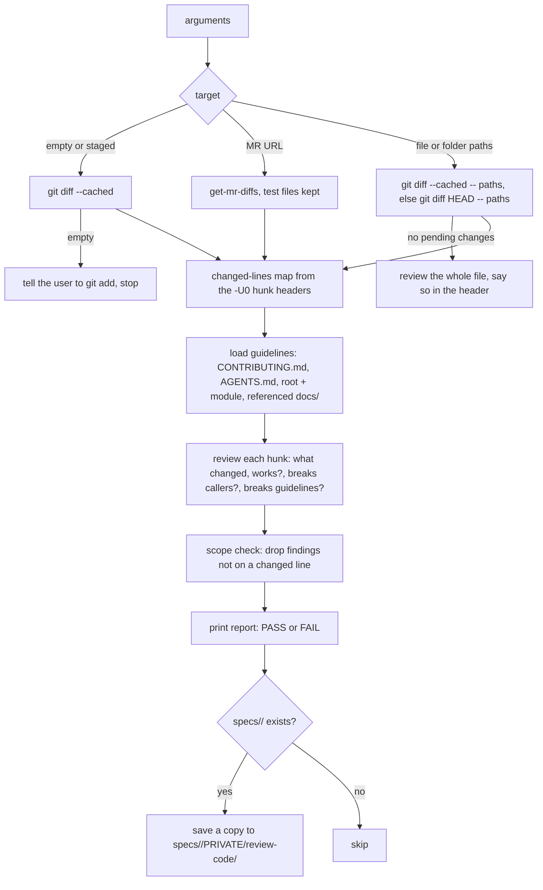
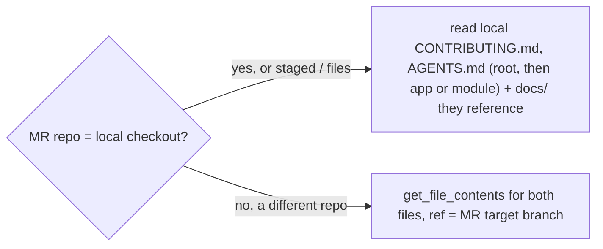

# review-code

Reviews only the changed lines of staged changes, files or a GitLab merge request against the repo's guidelines. Reports only, never edits code.

## When to use it

- You staged changes and want a review before you commit.
- You want a review of a GitLab MR, scoped to what the MR changes.
- You want pending changes in some files or folders reviewed.
- Say: "review my staged changes", "review this MR", "review src/auth".

| You want | Use instead |
|----------|-------------|
| Just the MR diff, no review | `get-mr-diffs` |
| A copy-paste changelog of the MR | `generate-changelog` |
| A new MR title and description | `update-merge-request` |
| To commit the staged changes | `commit` |

## How it works

Pick the target, then review changed lines only.



Where the guidelines come from:



Rules the diagrams don't show:

- Every finding's `file:line` must be in the changed-lines map, or it is dropped.
- A pre-existing problem counts only when the change makes it worse or newly reachable. It gets a `[pre-existing]` label.
- Breaking a loaded guideline is CRITICAL. Any CRITICAL finding means FAIL.
- MR findings use line numbers from the MR head.

## Input → output

Input: `[staged | <merge-request-url> | file paths...]`. Empty means staged.

Output: a chat reply with the review. Header (files, scope, changed lines, language), then Critical Issues, Warnings, Suggestions, Positive Notes, `Review Result: PASS | FAIL` and `Findings dropped as out-of-scope: <n>`.

When a spec folder matches the branch, a copy is also saved:

```
specs/<folder>/PRIVATE/review-code/
├── review-mr-<iid>-round-<n>.md        MR review
└── review-<target>-round-<n>.md        staged or file review, e.g. review-staged-round-1.md
```

`<n>` starts at 1 and never overwrites: each run takes the next free number.

## Files in the skill folder

| Path | What |
|------|------|
| [SKILL.md](SKILL.md) | The agent's instructions |

## Related skills

- `get-mr-diffs`: fetches the MR diff in MR mode.
- `commit`: commits the staged changes once the review passes.
- `update-merge-request`: rewrites the MR text after review.
