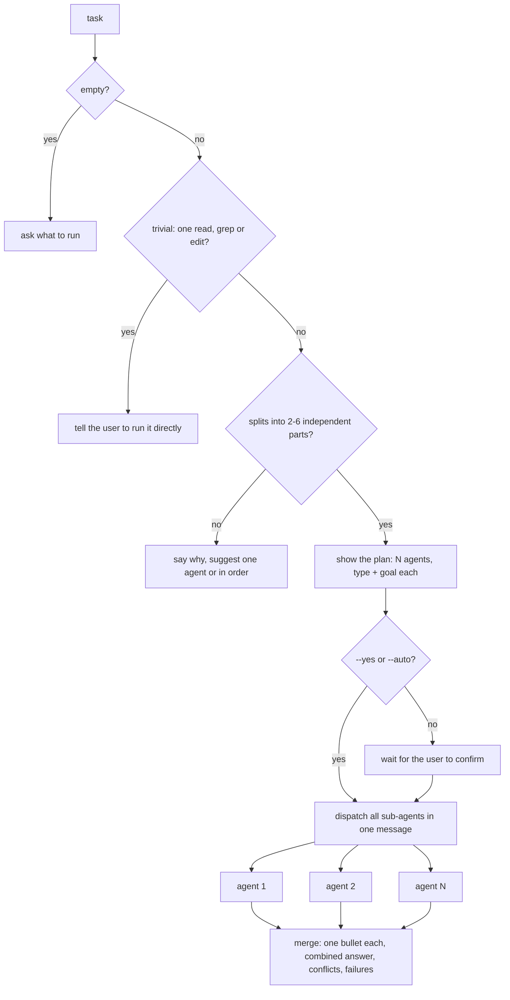

# run-parallel

Splits a task into 2-6 independent sub-tasks and runs them at once with several sub-agents, then merges the results.

## When to use it

- A task has parts that don't depend on each other, e.g. research in several areas or edits to separate files.
- You want the parts done at the same time, with one combined answer.
- Say: "run this in parallel", "split this across agents".

| You want | Use instead |
|----------|-------------|
| A full feature plan | `design-feature` |
| A code review of changes | `review-code` |
| One small lookup or edit | no skill; ask directly |

## How it works

Check, plan, confirm, dispatch together, merge.



Rules the diagram doesn't show:

- Independent means: no sub-task needs another's output, and no two edit the same file.
- Agent type per sub-task: `Explore` to find things, `Plan` to design, `general-purpose` for research or writes, a specialized agent when one fits.
- Each sub-agent prompt is self-contained: paths, acceptance criteria, output format, a length cap, and research-only or write.
- More than 6 parts run in rounds. The agent never hands off the final merge.
- An agent with no sub-agents runs the sub-tasks itself, in order.

## Input → output

Input: `<task> [--yes | --auto]`. Without a flag, the agent waits for you to confirm the plan.

Output: a chat reply.

```
## Parallel Run Summary
Task, Agents dispatched
### Results          one line per sub-agent
### Combined Answer
### Issues           failures, conflicts, partial results; left out if none
```

## Files in the skill folder

| Path | What |
|------|------|
| [SKILL.md](SKILL.md) | The agent's instructions and the output format |

## Related skills

- None. It works on any task and calls sub-agents, not skills.
