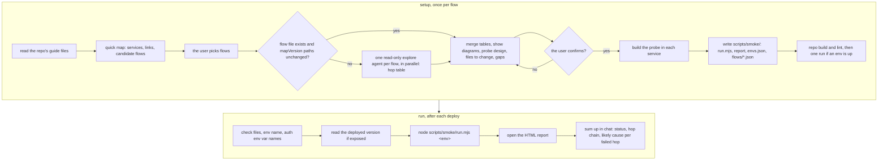
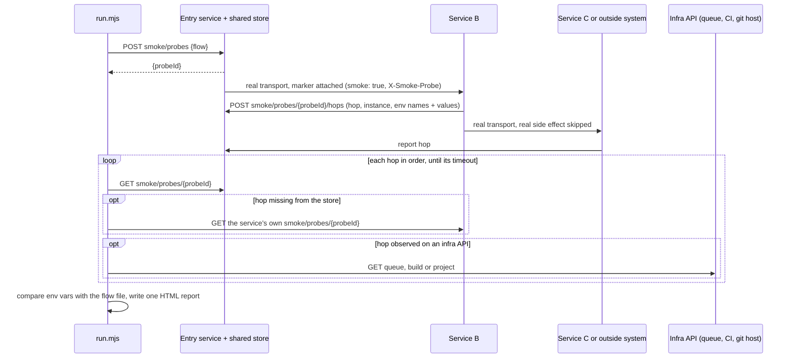
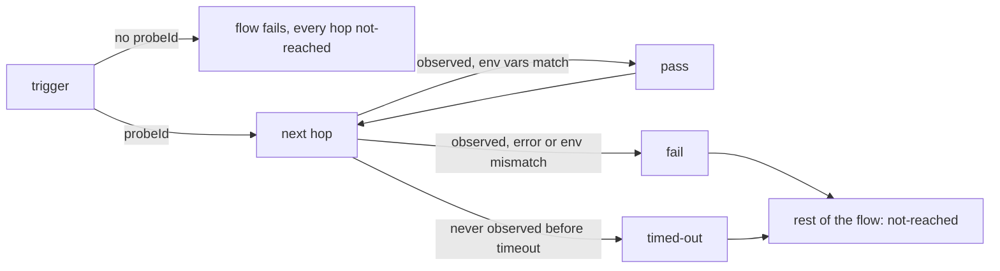

# smoke-test

Checks after a deploy that every service in a real flow still reaches the next one, with the right env vars, using a no-op probe.

## When to use it

- You deployed and want to know each service still talks to the next one: HTTP, gRPC, queue, CI, callbacks.
- You want to catch a wrong queue name, URL or credential before a user does.
- You want a probe and runner set up once in the repo, then rerun after every deploy.
- Say: "smoke test staging", "set up a smoke test", "smoke-test run dev deploy-ticket".

| You want | Use instead |
|----------|-------------|
| Browser tests of the UI, with screenshots | `e2e-test` |
| A test case file an AI runs later | `generate-test-cases` |
| The steps to do before and after a deploy | `deploy-plan` |
| A feature's scenarios played by hand on the running app | `play-scenarios` |
| Why a Jenkins build failed | `check-job` |

## How it works

Two modes. `setup` builds the probe once per flow. `run` checks it after each deploy. With no mode, the agent picks `run` when `scripts/smoke/flows/` exists, else `setup`.



What the probe does on one run:



How one flow's hops get their status:



Rules the diagrams don't show:

- No real work on the smoke path: no business writes, no notifications, no real builds, no git writes.
- Secrets never appear in plain text. Only env var names and `sha256:<8 hex>` are shown.
- One HTML report per run, never raw logs instead.
- Never runs against production unless the user named it for this run.
- The repo's guide files win on naming, permissions and who edits what.

## Input → output

Input: `setup [flow ...] | run <env> [flow ...]`

- `setup`: build the probe for the named flows, or ask which ones.
- `run <env>`: `<env>` is a key in `scripts/smoke/envs.json`. Flows left out means all.

Output of `setup`, in the target repo:

```
<repo>/
├── <each service in the flow>    probe code: smoke/probes endpoints, marker, hop report
├── README or contributor guide   a short "how to run the smoke test" section
├── .gitignore                    adds scripts/smoke/results/
└── scripts/smoke/
    ├── README.md                 how to run it, for teammates
    ├── run.mjs                   the runner, copied unchanged
    ├── report-template.html      the report page, copied unchanged
    ├── envs.json                 base URLs per env, no tokens
    └── flows/
        └── <flow>.json           trigger, store and hops for one flow
```

Output of `run`:

```
scripts/smoke/results/
└── smoke-report-<env>-<YYYYMMDD-HHMMSS>.html
```

Plus a chat summary: overall status, one line per flow, every failed hop with its likely cause, the report path.

## Files in the skill folder

| Path | What |
|------|------|
| [SKILL.md](SKILL.md) | The agent's instructions |
| [references/explore-agent.md](references/explore-agent.md) | Prompt for the per-flow explore agent, and how to merge the hop tables |
| [references/probe-contract.md](references/probe-contract.md) | What each service builds: entry call, hop report, shared store, safety rules |
| [references/flow-map.md](references/flow-map.md) | `scripts/smoke/` layout, `envs.json` and `flows/<flow>.json` fields, report data |
| [template/run.mjs](template/run.mjs) | The runner: triggers each flow, polls each hop, writes the report. Node 18+, no dependencies |
| [template/report-template.html](template/report-template.html) | The report page; the runner fills in the data |
| [template/README.md](template/README.md) | Ships as `scripts/smoke/README.md` |

## Related skills

- `deploy-plan`: lists the post-deploy steps; a smoke run is one of them.
- `e2e-test`: checks the UI in a browser; its report has the same layout.
- `check-job`: explains a failed Jenkins build.
- `play-scenarios`: plays a feature's scenarios by hand on the running app.
