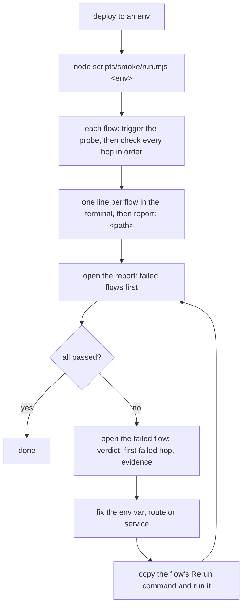

# Smoke test

A runner that checks, after a deploy, that every service in each flow still reaches the next one with the right env vars, and writes one HTML report.

## How to run it

1. Set the auth env vars the flow files name (for example `SMOKE_TOKEN`). The runner reads them from your shell; they never go in a file.

    ```bash
    export SMOKE_TOKEN=...
    ```

2. Run it from the repo root. Node 18+, no install step.

    ```bash
    node scripts/smoke/run.mjs <env>
    ```

    - `<env>` is a key in `envs.json`, e.g. `local` or `dev`.
    - Add flow names to run only those: `node scripts/smoke/run.mjs dev deploy-ticket`.
    - `--out <dir>` writes the report somewhere else (default `scripts/smoke/results/`).

3. Open the HTML file on the last line of the output: `report: <path>`.

    - Exit code `0`: every flow passed. `1`: a flow failed. `2`: the run could not start.

## Using it



- The probe does no real work: no business writes, no notifications, no real builds, no git writes. Its records expire on their own.
- Secrets show as `****` or `sha256:<8 hex>`, never in plain text.
- Use the Export PDF button in the report to save it as a PDF.

## Files

| File | What |
|------|------|
| `run.mjs` | The runner: triggers each flow, polls each hop until its timeout, writes the report |
| `report-template.html` | The report page; `run.mjs` fills in the data |
| `envs.json` | Base URLs per env, plus optional `hopTimeoutMs` and `requestTimeoutMs`. No tokens |
| `flows/<flow>.json` | One flow: the trigger call, the shared store, and each hop with the env vars it must use |
| `results/` | The reports; git-ignored |

## When it fails

| You see | Do this |
|---------|---------|
| `usage: node scripts/smoke/run.mjs <env> [flow ...] [--out <dir>]` | Pass an env name. |
| `unknown env "…" — known: …` | Use one of the listed envs, or add it to `envs.json`. |
| `no flow matched in …` | Check the flow names you passed against the `flow` field in `flows/*.json`. |
| `envs.json has no base URL for "…" in "…"` | Add that service's base URL (ending in `/`) under the env in `envs.json`. |
| `env var … is not set (needed for … auth)` | Export that env var in your shell, then run again. |
| `trigger answered HTTP … without probeId` | The entry call failed. A 404 means the probe endpoint is not deployed in this version; a 401/403 means a wrong or expired token. |
| `NAME = used (expected want)` | Env var mismatch: the service runs with a different value than the flow file expects (wrong queue, URL or key). Fix the service's config or the flow file. |
| `not observed within … ms · … polls, last HTTP …` | The hop never showed up: wrong exchange, queue or route, consumer down, or a crash before it reported. A 404 on the store means the probe id is unknown there (wrong store, expired, or another replica). |
| `HTTP 401` / `HTTP 403` on a hop | A wrong or expired credential on that link. |
| Hop missing from the store but found on the service | The service cannot report to the store. The link itself works. |
| `not reached` | An earlier hop failed. Fix that one first. |
| `unknown observe.type "…" on hop …` / `unknown auth type …` | A typo in `flows/<flow>.json`. Valid observe types: `store`, `service`, `http`. Auth types: `bearer`, `basic`, `header`. |
