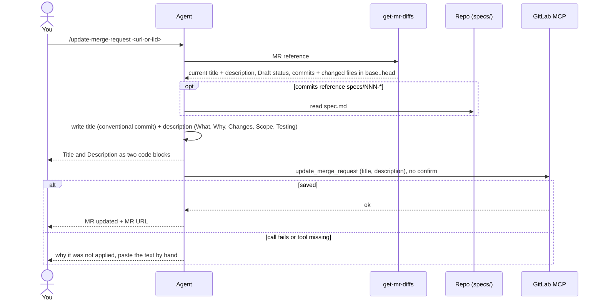

# update-merge-request

Rewrites a GitLab merge request's title and description from its diff, then saves them to the MR with no confirm step.

## When to use it

- The MR title or description is stale, templated or empty.
- You want the MR text to match what `base_sha..head_sha` really changes.
- Run it by name only: `/update-merge-request <url-or-iid>`. The agent never starts it on its own.

| You want | Use instead |
|----------|-------------|
| A copy-paste changelog, MR left alone | `generate-changelog` |
| A Thanos announcement for platform users | `announce` |
| A code review of the MR | `review-code` |
| A commit message for staged changes | `commit` |

## How it works



Rules the diagram doesn't show:

- The suggested title drops a `Draft:` prefix, but the agent tells you if the MR is still a Draft.
- Later branch commits outside the MR head are named as not yet in the MR.
- No local paths, sandbox names or vendor lock-in names in the text. Repo-relative paths only.
- Only what the diff shows. No invented features.

## Input → output

Input: `<merge-request-url-or-iid>` (also `project!iid`, see `get-mr-diffs`).

Output: a chat reply with two code blocks, and the same text saved to the MR.

```
**Title**        one line, e.g. feat(scope): <title>
**Description**  raw Markdown: ## What, ## Why, ## Changes, ## Scope, ## Testing, spec link if any
```

## Files in the skill folder

| Path | What |
|------|------|
| [SKILL.md](SKILL.md) | The agent's instructions |

## Related skills

- `get-mr-diffs`: fetches the MR metadata and diff.
- `generate-changelog`: the same summary as a copy-paste block, MR untouched.
- `review-code`: reviews the MR before you update its text.
