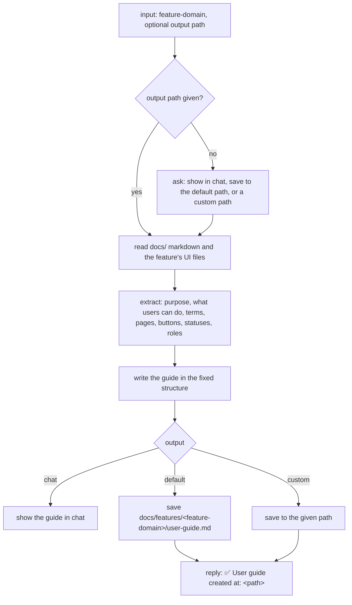

# user-guide

Writes a markdown user guide for a feature, in plain words for end users, from its docs and UI code.

## When to use it

- A feature is built and you need to explain it to the people who use it, not to developers.
- You want numbered steps, a screenshot placeholder for every UI action, and a troubleshooting section.
- Say: "write a user guide for X", "explain this feature to users".

| You want | Use instead |
|----------|-------------|
| A styled HTML docs page with sidebar and search | `html-document` |
| A slide deck | `html-presentation` |
| An announcement of a merged change | `announce` |
| A changelog of an MR | `generate-changelog` |
| The feature's use cases and scenarios as data | `generate-use-case` |

## How it works



The guide always has these sections, in order:

1. What is the feature? (2-3 sentences)
2. Key Concepts
3. How To: one section per main task, with a screenshot placeholder and numbered steps
4. Common Scenarios
5. Troubleshooting: problem, cause, solution
6. Quick Reference: action, where, permission
7. Tips

Writing rules:

- Simple words, short sentences, active voice, "you".
- Every step numbered. A screenshot placeholder for every UI action.
- No jargon, no code, no API references.

## Input → output

Input: `<feature-domain>` or `<feature-domain> <output-path>`

Output: a chat reply, or one markdown file.

```
docs/features/<feature-domain>/
└── user-guide.md     default path; or the custom path the user gave
```

## Files in the skill folder

| Path | What |
|------|------|
| [SKILL.md](SKILL.md) | The agent's instructions, including the guide's structure |

## Related skills

- `html-document`: turns the guide into a styled HTML page.
- `html-presentation`: the same content as slides.
- `announce`: tells users about a change when it ships.
