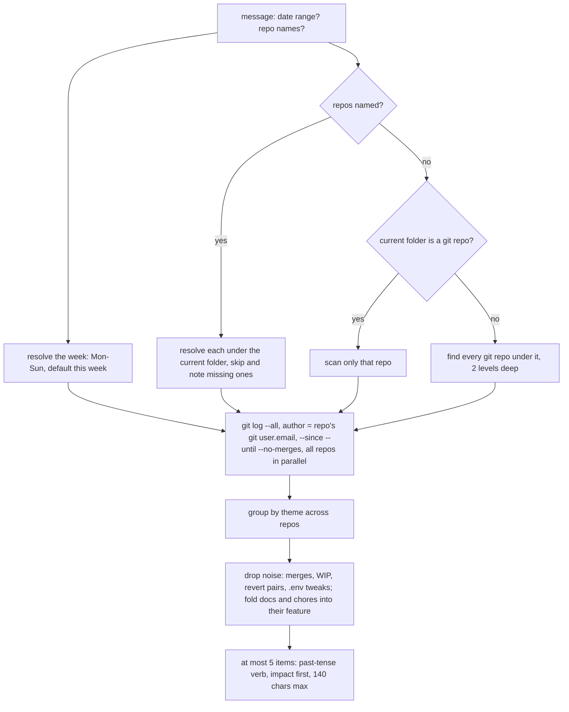

# weekly-work-log

Turns your git commits for one week into up to 5 achievement items, each 140 characters or less, ready to paste.

## When to use it

- You need to fill in your weekly achievements from what you actually committed.
- You want commits across several repos grouped by feature, not by repo.
- Say: "log my work", "weekly achievements for last week".

| You want | Use instead |
|----------|-------------|
| A changelog for one merge request | `generate-changelog` |
| A record of one problem and its fix | `issue-log` |
| A commit message for staged changes | `commit` |

## How it works

Find the repos, read the week's commits, group by theme, write short items.



Rules the diagram doesn't show:

- `cd` to the repo, or to the folder that holds your repos, before you run it.
- A theme that spans repos (web, pipeline, terraform) is one item.
- Repos with no commits in range are left out. No commits, no made-up items.
- Ask for more or fewer items and it rewrites them; the 140-character cap stays.

## Input → output

Input: an optional date range ("29 June - 5 July", "last week", "week 28") and optional repo names ("only thanos").

Output: a chat reply.

````
**1.**

```text
<item 1, nothing else, so one click copies it>
```

**2.** ... up to **5.**

<1-2 sentence week overview>
````

## Files in the skill folder

| Path | What |
|------|------|
| [SKILL.md](SKILL.md) | The agent's instructions: which repos, git command, item rules |

## Related skills

- `generate-changelog`: the same kind of summary, for one merge request.
- `issue-log`: a daily log of problems, where this one is a weekly log of wins.
