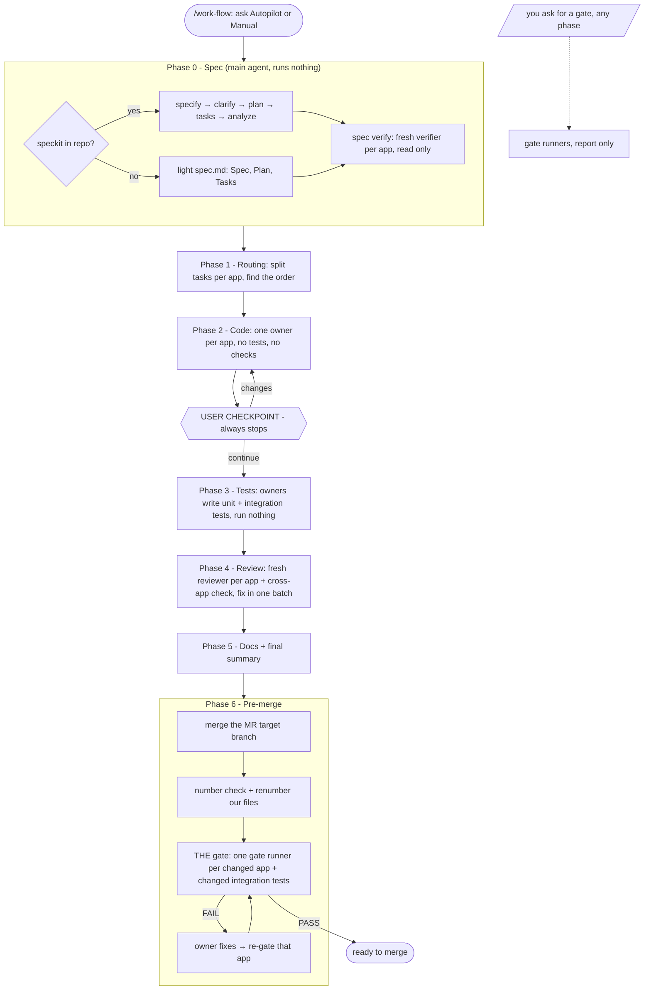

# work-flow

Carries one feature, bug fix or hotfix from idea to a merge-ready branch, in the same phases on every project.

## When to use it

- You start a feature, bug fix or hotfix and want a fixed flow: spec, code, your review, tests, AI review, docs, pre-merge gate.
- You want sub-agents to write the code, one per app, and fresh sub-agents to review it.
- Run: `/work-flow add CSV export to the users page`, or `/work-flow specs/127-user-export` to resume, or `/work-flow` for status.
- Slash only. The agent never starts it by itself.

| You want | Use instead |
|----------|-------------|
| A full HTML plan of a feature, no code | `design-feature` |
| Only the use cases and scenarios | `generate-use-case` |
| A review of a diff you already have | `review-code` |
| To try the scenarios by hand on the running app | `play-scenarios` |

## How it works



- **Autopilot**: a decider sub-agent answers the questions in Phases 0–2. **Manual**: you answer them.
- The checkpoint after Phase 2 stops in both modes. You try the code first; tests come after you confirm.
- No build, lint or test runs before Phase 6, unless you ask for a gate.
- The main agent only orchestrates. App code is changed by the app's owner sub-agent.

## Project profile

The flow reads a `## Flow profile` section in the project's root `AGENTS.md` or `CLAUDE.md`: apps, guides, owner agents, gate commands, integration tests, numbered folders, docs paths. With no profile, it detects what it can, asks you for the rest, and offers to save it. See [references/profile.md](references/profile.md).

## Input → output

Input: `<what you want | spec-folder [phase] | (empty)>`

Output:

```
<spec folder>/
├── spec.md, plan.md, tasks.md, ...   from speckit
│   or spec.md                        the light spec (Spec, Plan, Tasks)
└── flow.md                           mode, phase, apps, target branch, next step
```

Plus the code, tests and docs changes on the working branch. Nothing is committed unless you ask.

## Files in the skill folder

| Path | What |
|------|------|
| [SKILL.md](SKILL.md) | The agent's instructions: phases, hard rules, modes |
| [references/profile.md](references/profile.md) | The project profile and how to detect it |
| [references/roles.md](references/roles.md) | Prompts for owner, reviewer, spec verifier, gate runner, decider |
| [references/spec.md](references/spec.md) | Phase 0: speckit or the light spec, then spec verify |
| [references/code.md](references/code.md) | Phases 1–2 and the user checkpoint |
| [references/tests.md](references/tests.md) | Phase 3 |
| [references/review-docs.md](references/review-docs.md) | Phases 4–5 |
| [references/pre-merge.md](references/pre-merge.md) | Phase 6 and gates on request |

## Related skills

- `generate-use-case`, `design-feature`: can feed the spec.
- `review-code`: reviewers may use it for the diff.
- `play-scenarios`: try the code by hand at the checkpoint.
